# Semantic Layer POC - Complete Deployment Flowchart

This document contains visual flowcharts showing the complete deployment process from scratch to a fully functional semantic layer POC.

---

## 📋 Table of Contents

1. [High-Level Overview](#high-level-overview)
2. [Detailed Deployment Flow](#detailed-deployment-flow)
3. [Architecture Layers](#architecture-layers)
4. [Decision Tree: Which Deployment Method?](#decision-tree-which-deployment-method)
5. [Validation Flow](#validation-flow)
6. [Troubleshooting Decision Tree](#troubleshooting-decision-tree)

---

## High-Level Overview

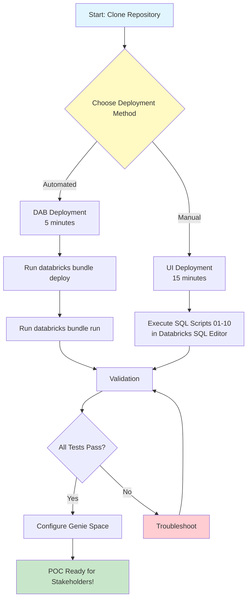

---

## Detailed Deployment Flow

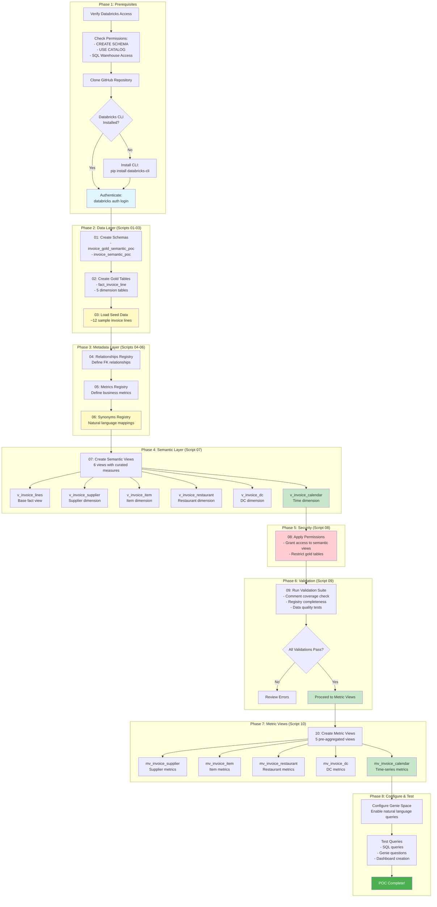

---

## Architecture Layers

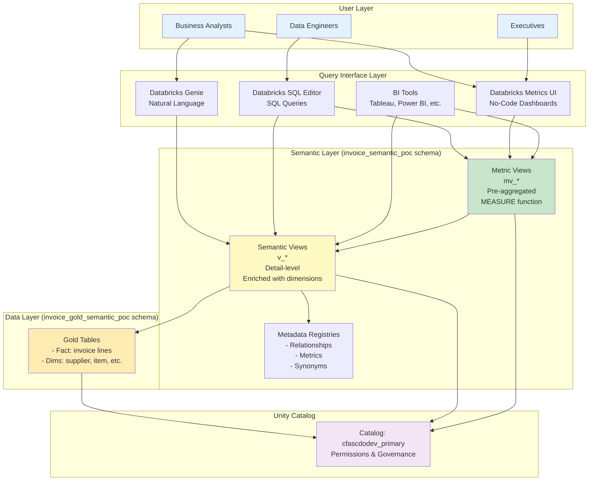

---

## Decision Tree: Which Deployment Method?

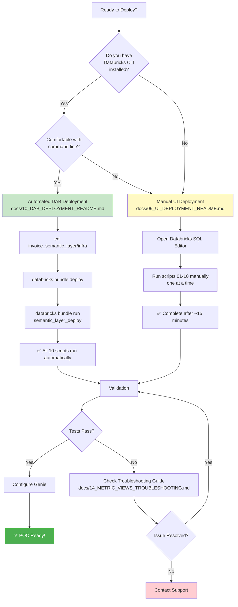

---

## Validation Flow

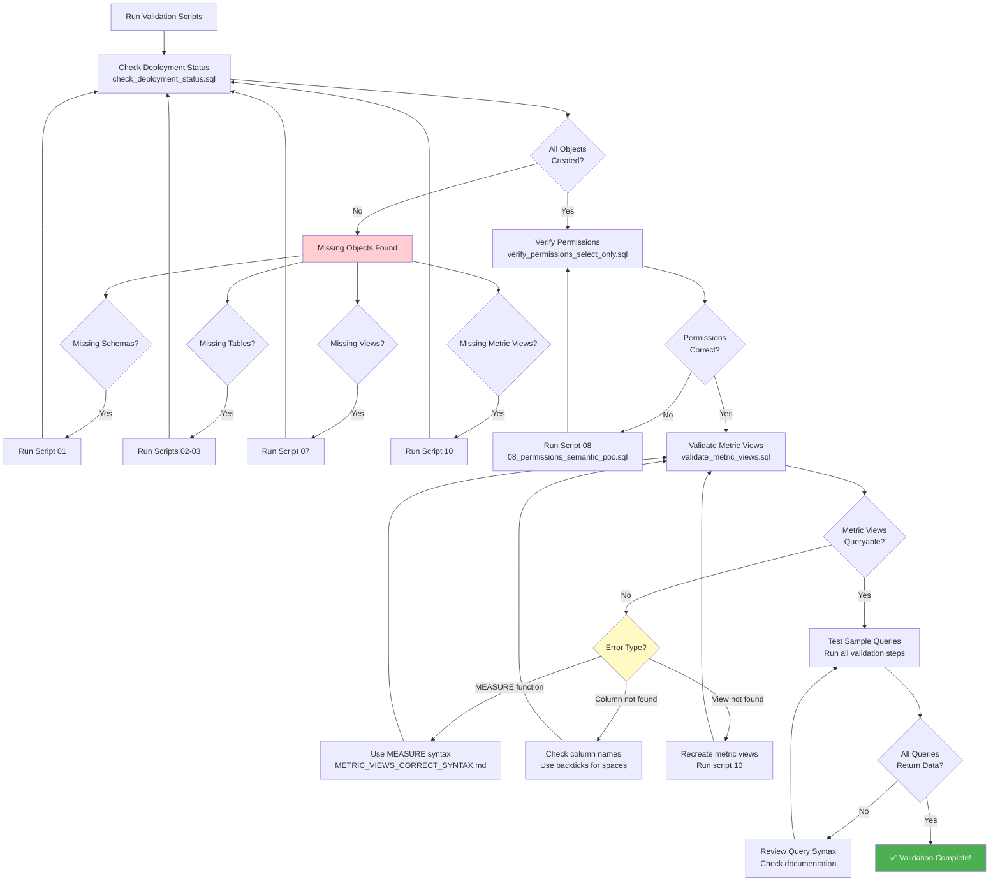

---

## Troubleshooting Decision Tree

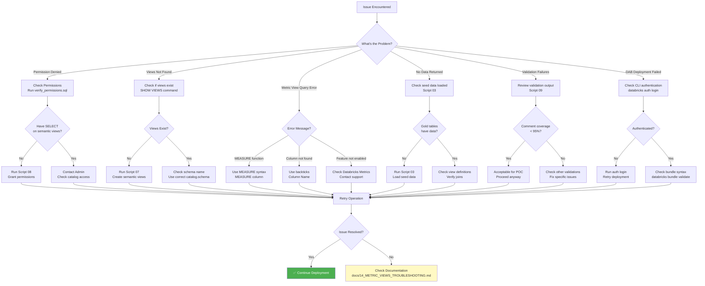

---

## Script Execution Order

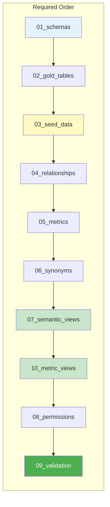

**Why this order?**
- **01-03**: Data layer must exist first
- **04-06**: Metadata registries reference tables from step 2
- **07**: Semantic views reference gold tables and registries
- **10**: Metric views reference semantic views
- **08**: Permissions applied after all objects created
- **09**: Validation runs last to verify everything

---

## Query Pattern Flow

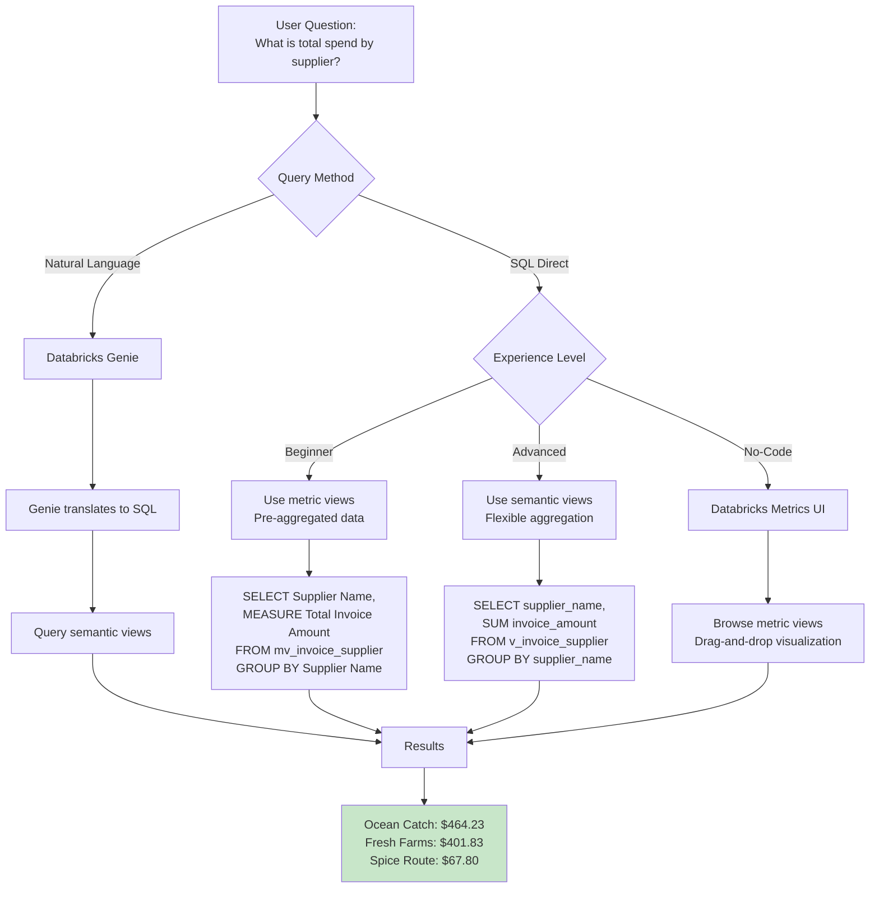

---

## Data Flow Architecture

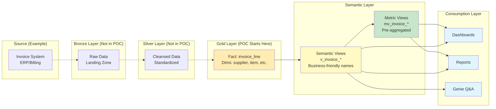

**Note**: This POC starts at the Gold layer with pre-prepared sample data.

---

## Complete POC Timeline

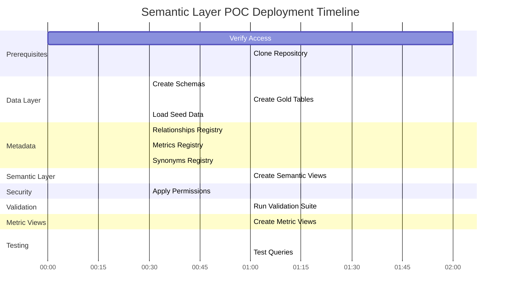

**Total Time**: ~15 minutes (manual) or ~5 minutes (automated)

---

## Documentation Navigation Map

```mermaid
graph TB
    START[00_README_START_HERE.md<br/>Master Hub] --> QUICK[01_QUICK_START_GUIDE.md<br/>5-min overview]

    START --> ARCH[Architecture Docs]
    ARCH --> A1[03_ARCHITECTURE_OVERVIEW.md]
    ARCH --> A2[04_ARCHITECTURE_DETAILED.md]
    ARCH --> A3[05_SEMANTIC_COMPONENTS.md]

    START --> DEPLOY[Deployment Docs]
    DEPLOY --> D1[06_DEPLOYMENT_CHECKLIST.md]
    DEPLOY --> D2[07_DEPLOYMENT_WALKTHROUGH.md]
    DEPLOY --> D3[08_SQL_RUNBOOK.md]
    DEPLOY --> D4[09_UI_DEPLOYMENT_README.md]
    DEPLOY --> D5[10_DAB_DEPLOYMENT_README.md]
    DEPLOY --> D6[11_DAB_FLOW.md]

    START --> METRIC[Metric Views Docs]
    METRIC --> M1[12_METRIC_VIEWS_EXPLAINED.md]
    METRIC --> M2[13_METRIC_VIEWS_YAML_GUIDE.md]
    METRIC --> M3[14_METRIC_VIEWS_TROUBLESHOOTING.md]
    METRIC --> M4[METRIC_VIEWS_CORRECT_SYNTAX.md]
    METRIC --> M5[METRIC_VIEWS_QUERY_GUIDE.md]

    START --> POST[Post-Deployment]
    POST --> P1[16_GENIE_SPACE_SETUP.md]
    POST --> P2[17_CLEANUP_AND_REDEPLOY_GUIDE.md]

    START --> VALID[Validation Scripts]
    VALID --> V1[check_deployment_status.sql]
    VALID --> V2[verify_permissions_select_only.sql]
    VALID --> V3[validate_metric_views.sql]

    style START fill:#4caf50,color:#fff
    style QUICK fill:#c8e6c9
```

---

## Summary

This flowchart document provides:

✅ **7 different diagrams** showing:
1. High-level overview
2. Detailed step-by-step flow
3. Architecture layers
4. Decision tree for deployment method
5. Validation workflow
6. Troubleshooting decision tree
7. Script execution order

✅ **Additional diagrams** for:
- Query pattern flow
- Data flow architecture
- Complete timeline (Gantt chart)
- Documentation navigation map

---

## How to Use These Diagrams

1. **New stakeholders**: Start with "High-Level Overview"
2. **Deploying**: Follow "Detailed Deployment Flow" or "Decision Tree"
3. **Troubleshooting**: Use "Troubleshooting Decision Tree"
4. **Understanding architecture**: Review "Architecture Layers" and "Data Flow"
5. **Validating**: Follow "Validation Flow"

---

## Viewing on GitHub

These Mermaid diagrams will render automatically when you view this file on GitHub. For local viewing, use a Mermaid-compatible markdown viewer or the [Mermaid Live Editor](https://mermaid.live/).

---

## Related Documentation

- [00_README_START_HERE.md](invoice_semantic_layer/docs/00_README_START_HERE.md) - Master documentation hub
- [01_QUICK_START_GUIDE.md](invoice_semantic_layer/docs/01_QUICK_START_GUIDE.md) - Quick start guide
- [06_DEPLOYMENT_CHECKLIST.md](invoice_semantic_layer/docs/06_DEPLOYMENT_CHECKLIST.md) - Printable checklist
- [10_DAB_DEPLOYMENT_README.md](invoice_semantic_layer/docs/10_DAB_DEPLOYMENT_README.md) - Automated deployment
