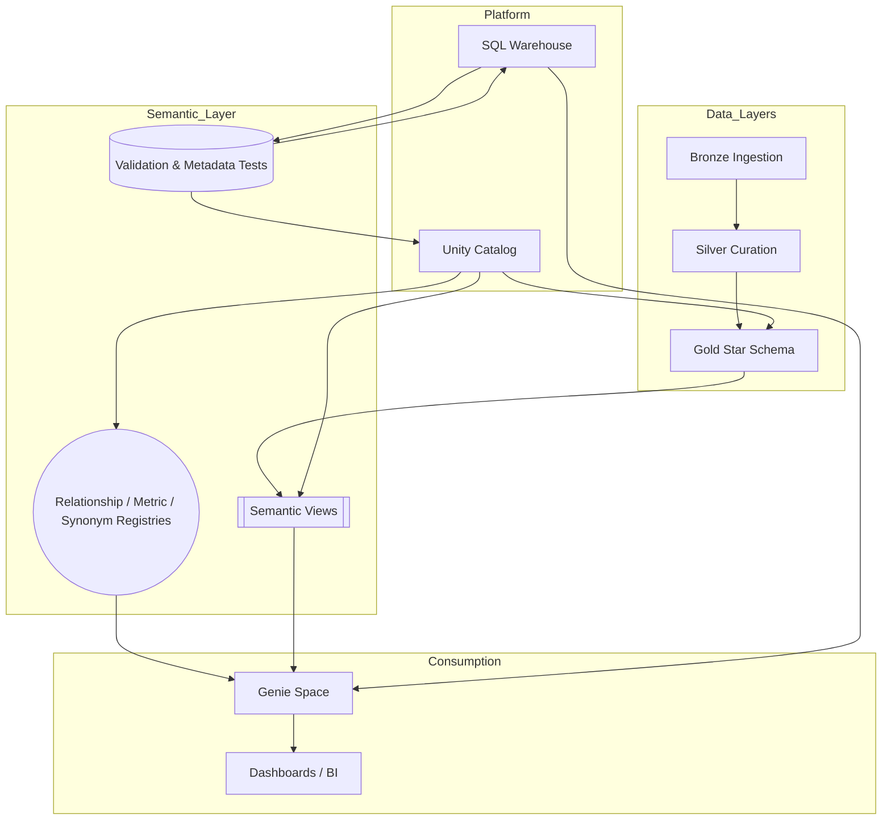
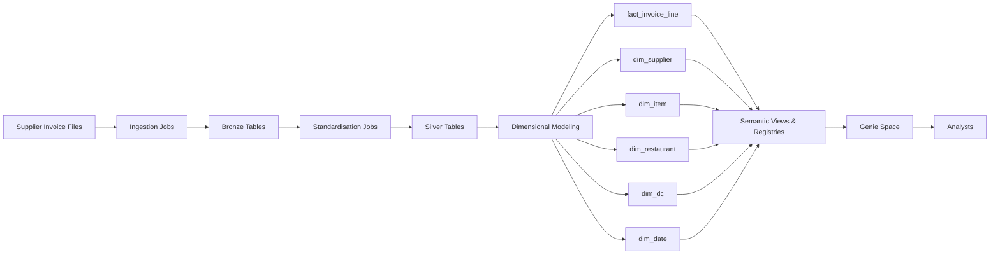
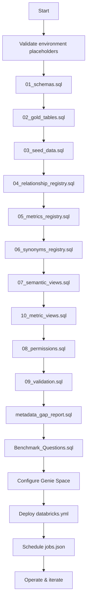

# Semantic Layer Architecture Overview

## Audience & Intent
- **Who**: Product owners, analytics leaders, and engineering stakeholders who need the "big picture" view.
- **What**: High-level structure of the semantic layer, how data moves, and the major control points.
- **Why**: Establish shared understanding before diving into detailed design or implementation documents.

## Visual 1 - Layered Architecture (What lives where)

**Explanation**: Raw data lands in medallion layers (bronze -> silver -> gold). The semantic schema layers curated views and registries on top, all governed by Unity Catalog. Genie consumes only semantic assets so analysts see clean data.

## Visual 2 - Data Flow at a Glance (How information travels)

**Explanation**: Once gold tables exist, semantic scripts project business-friendly views and registries. Genie is configured over those assets, giving analysts curated access without touching raw tables.

## Visual 3 - Deployment Flow (Step-by-step execution order)

**Explanation**: The flow highlights when each asset is applied and the dependencies between them. Validation and automation steps provide the control gates.

## Pillars & Benefits
| Pillar | Components | Why it Matters |
|--------|------------|----------------|
| Governance by design | Unity Catalog, permissions script, comment standards | Ensures analysts only access curated assets and every object is documented. |
| Semantic intelligence | Views, relationship registry, metrics registry, synonyms | Gives Genie (and analysts) consistent joins, definitions, and NLQ vocabulary. |
| Quality assurance | Validation SQL, metadata gap report, benchmarks | Catches issues early-missing comments, broken joins, metric drift-before analysts are impacted. |
| Automation & longevity | Databricks Asset Bundle, scheduled jobs | Keeps environments aligned, automates validations, and supports production operations. |

## Key Takeaways
- All analyst queries should flow through semantic views; direct gold access is intentionally blocked.
- Registries (relationships, metrics, synonyms) are the "brains" enabling NLQ accuracy and consistent KPIs.
- Validation, automation, and documentation are not optional extras-they protect trust and speed.

For deeper technical detail, owners can refer to `ARCHITECTURE_DETAILED.md`.

