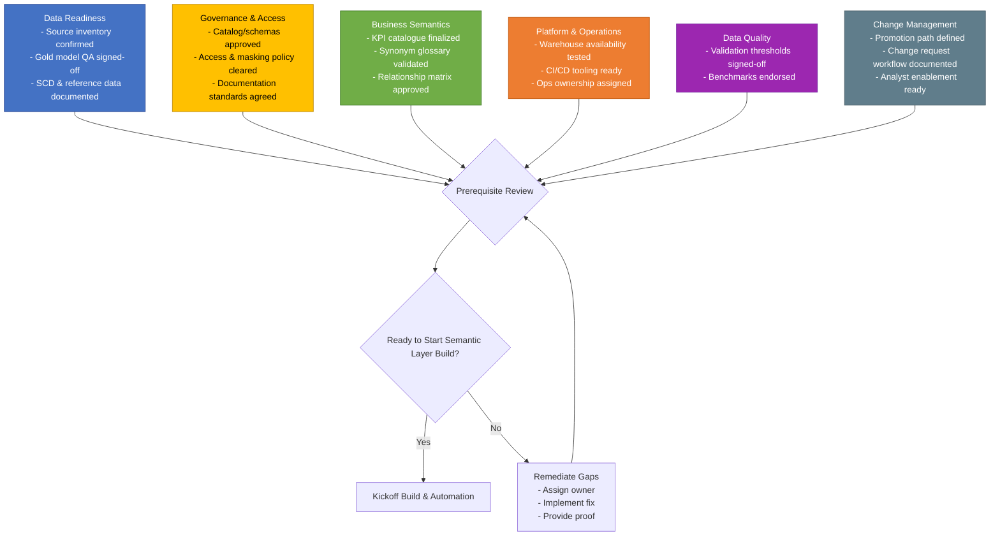

# Semantic Layer Prerequisites Playbook

## 1. Purpose
The semantic layer relies on trusted gold data, documented business definitions, and operating controls. This playbook ensures everyone understands the questions to resolve, why they matter, and how to validate readiness.

## 2. How to Use This Playbook
1. Convene stakeholders from data engineering, analytics engineering, governance, platform operations, and business teams.
2. Walk through each prerequisite section, documenting answers and linking artefacts.
3. Record gaps and assign remediation owners/target dates.
4. Re-run the review once gaps are closed; only then trigger semantic layer engineering.
5. Maintain the artefacts (KPI catalogue, governance approvals, validation specs) alongside the codebase for traceability.

## 3. Detailed Prerequisites

### 3.1 Data Readiness
| # | Question | What "Yes" Looks Like | Why It Matters | Consequence if Ignored | Primary Owner(s) | Example Artefacts |
|---|----------|------------------------|----------------|------------------------|------------------|-------------------|
| D1 | Which upstream systems supply invoices, suppliers, restaurants, distribution centers, and items? | Inventory of source systems, owners, refresh cadences, and data contracts. | Defines ingestion scope and aligns transformations with source nuances. | Missing feeds create fact/dim gaps and broken joins. | Data Engineer, Source System Owners | Source system registry, lineage diagram, ingestion design |
| D2 | Are gold fact and dimension tables modeled, populated, and validated? | Star-schema tables live in `invoice_gold_semantic_poc` with QA sign-off on counts, null checks, key coverage. | Semantic views assume gold tables are correct; otherwise errors propagate. | Analysts receive wrong spend numbers; validation/benchmarks fail. | Data Engineer | ERD, QA results, unit test notebook |
| D3 | How are slowly changing dimensions handled (type, effective dating)? | Documented SCD strategy with effective_from/effective_to rules. | Ensures historical analysis matches finance reporting. | Point-in-time questions give inconsistent answers, eroding trust. | Data Engineer, Analytics Engineer | Dimension design doc, example queries |
| D4 | Are reference datasets (currency codes, regions) standardized? | Reference tables align with corporate standards. | Prevents mismatched labels and ensures filters behave correctly. | Duplicate categories or mis-aggregations in Genie outputs. | Data Engineer | Reference data spec, validation queries |

### 3.2 Governance & Access
| # | Question | What "Yes" Looks Like | Why It Matters | Consequence if Ignored | Primary Owner(s) | Example Artefacts |
|---|----------|------------------------|----------------|------------------------|------------------|-------------------|
| G1 | Which catalog and schemas host gold vs semantic assets? | Catalog `cfascdodev_primary` with schemas `invoice_gold_semantic_poc` and `invoice_semantic_poc` approved and owned. | Needed for scripts, grants, automation variables. | Deployments fail or land in uncontrolled namespaces. | Platform Admin | UC governance plan, RBAC matrix |
| G2 | Who authorizes analyst access? | Governance lead approves membership (e.g., `account users` or target group). | Ensures compliance before enabling Genie. | Unauthorized access or audit findings. | Governance Lead | Access approvals, ticket records |
| G3 | What comment/documentation standard applies (>=95%)? | Team commits to comment coverage and knows validation thresholds. | Validation enforces documentation; clarity prevents last-minute failures. | Automated validation fails, delaying releases. | Governance Lead, Data Engineer | Documentation policy, comment templates |
| G4 | Any data retention/masking requirements? | Compliance confirms masking/retention and how semantic views handle it. | Ensures PII/compliance obligations before exposure. | Violations or rework to retrofit masking. | Governance Lead, Legal | Data classification report, masking strategy |

### 3.3 Business Semantics & Metrics
| # | Question | What "Yes" Looks Like | Why It Matters | Consequence if Ignored | Primary Owner(s) | Example Artefacts |
|---|----------|------------------------|----------------|------------------------|------------------|-------------------|
| B1 | What KPIs are in scope? | KPI catalogue with definitions, formulas, owners, tags. | Feeds metrics registry; aligns with finance expectations. | Conflicting numbers between Genie and dashboards. | Analytics Engineer, Finance | KPI dictionary, reporting deck |
| B2 | Agreed business rules for discounts, freight, tax allocations? | Documented logic reviewed by finance/logistics. | Ensures semantic views reflect business reporting. | Misinterpretation leads to escalations. | Analytics Engineer, Finance | Business rule doc, sample calculations |
| B3 | Vocabulary/synonyms analysts use? | Glossary mapping terms (e.g., store, spend) to canonical names. | Enables accurate NLQ mapping in Genie. | Genie misinterprets prompts, reducing adoption. | Analytics Engineer, Analyst SMEs | Vocabulary workshop notes |
| B4 | Trusted fact-to-dimension joins with confidence? | Relationship matrix with join type, confidence, caveats. | Populates relationship registry and guides Genie joins. | Genie uses unsafe joins, producing wrong answers. | Analytics Engineer, Data Engineer | Join validation notebook |

### 3.4 Platform & Operational Readiness
| # | Question | What "Yes" Looks Like | Why It Matters | Consequence if Ignored | Primary Owner(s) | Example Artefacts |
|---|----------|------------------------|----------------|------------------------|------------------|-------------------|
| P1 | Is the target SQL warehouse provisioned? | Warehouse (e.g., `General Purpose`) accessible to deployment principal and sized appropriately. | All SQL scripts and Genie rely on it. | Deployment fails; Genie cannot run queries. | Platform Admin | Warehouse config screenshot, access test |
| P2 | Are Databricks Asset Bundles/repos enabled? | Workspace supports DAB and repos. | `databricks.yml` pipeline depends on it. | Manual execution increases risk. | Platform Admin | Workspace capability checklist |
| P3 | Who owns job execution/incident response? | On-call rotation/runbook defined for nightly validation job. | Maintains trust post go-live. | Failures go unnoticed; analysts see stale data. | Platform Admin, Operations | Runbook, escalation matrix |
| P4 | Promotion paths defined (dev/test/prod)? | Strategy for moving bundles between environments. | Supports safe rollouts. | Direct prod edits risk outages. | Platform Admin, Governance Lead | Environment strategy diagram |

### 3.5 Data Quality & Validation
| # | Question | What "Yes" Looks Like | Why It Matters | Consequence if Ignored | Primary Owner(s) | Example Artefacts |
|---|----------|------------------------|----------------|------------------------|------------------|-------------------|
| Q1 | Are comment coverage thresholds documented (>=95%)? | Agreed threshold and remediation steps when below target. | Aligns with `09_validation_semantic_poc.sql` PASS/FAIL. | Disputes over "done" cause delays. | Governance Lead | QA policy, validation checklist |
| Q2 | Metric reconciliation rules accepted? | Finance confirms invoice_amount formula (net + freight + tax - discount). | Validation confirms financial logic before release. | Unvetted logic may slip past validation and be rejected later. | Finance, Analytics Engineer | Reconciliation spec, sample results |
| Q3 | Genie benchmark questions approved? | Business endorses benchmark prompts and expected answers. | `/notebooks/Benchmark_Questions.sql` certifies NLQ readiness. | NLQ reliability can’t be proven; adoption suffers. | Analytics Engineer, Business Stakeholders | Benchmark acceptance sheet |

### 3.6 Change Management & Communication
| # | Question | What "Yes" Looks Like | Why It Matters | Consequence if Ignored | Primary Owner(s) | Example Artefacts |
|---|----------|------------------------|----------------|------------------------|------------------|-------------------|
| C1 | Change request process for metrics/synonyms/permissions? | Documented workflow (tickets, CAB) with SLAs and approvers. | Maintains governance after go-live. | Ad-hoc changes break automation. | Governance Lead | Change management SOP |
| C2 | Analyst onboarding to Genie/semantic views? | Training plan, FAQ, runbooks prepared. | Drives adoption and reduces support load. | Users revert to manual workarounds. | Analytics Enablement Lead | Training deck, onboarding checklist |
| C3 | Where do artefacts live? | Central repository (Confluence, SharePoint, repo docs) with access controls. | Supports audits and onboarding. | Knowledge silos; ramp-up slows. | Governance Lead, Platform Admin | Documentation portal |

## 4. Visual – Prerequisite Intake Flow (Expanded)

## 5. Intake Workshop Facilitation Tips
- Schedule a 60–90 minute session with cross-functional stakeholders.
- Ask owners to bring artefacts (documents, screenshots, query results).
- Log decisions/gaps in a shared tracker with due dates.
- Treat disagreements (e.g., metric definitions) as blockers with follow-up sessions.
- When everything shows “Yes,” document the decision and notify leadership that the build can start.

## 6. Ongoing Maintenance
- Revisit checklist when new data sources/metrics are added.
- Include prerequisite review in quarterly governance meetings.
- Use this checklist during onboarding for new team members.

This playbook gives stakeholders a clear, well-formatted prerequisite checklist before launching the semantic layer PoC.
