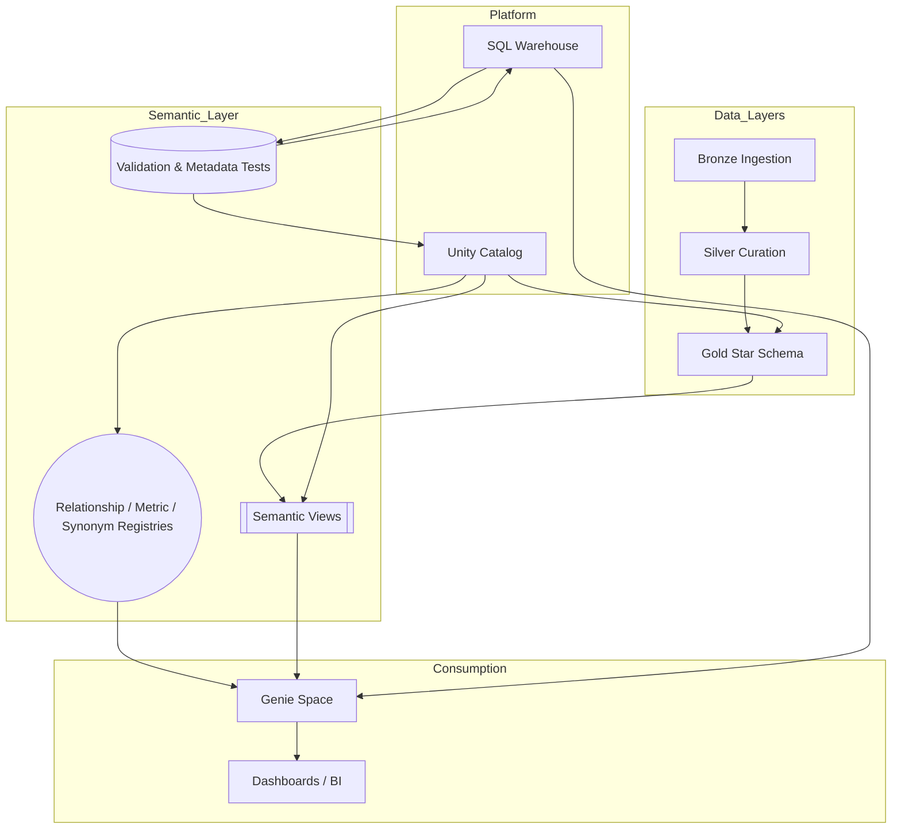
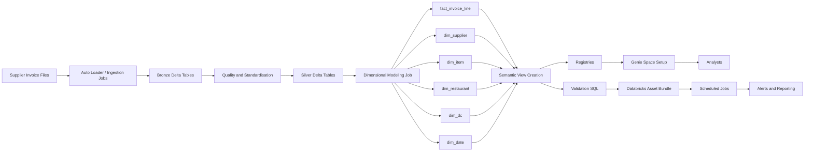
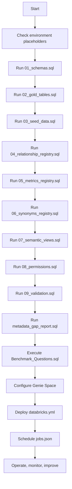
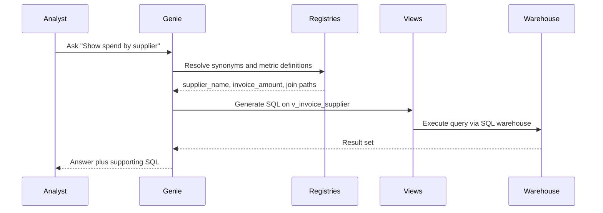
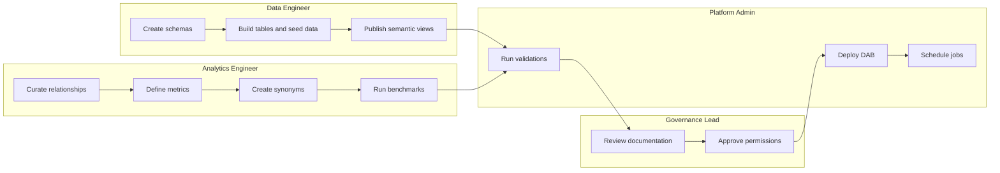

# Semantic Layer Architecture - Detailed Playbook

## 1. Context & Goals
- **Business Goal**: Deliver accurate invoice analytics to restaurant, sourcing, and finance stakeholders via Genie with minimal onboarding.
- **Technical Goal**: Provide a governed semantic layer over curated Delta tables using Unity Catalog, ensuring consistent joins, metrics, and NLQ vocabulary.
- **Success Criteria**: >=95 percent comment coverage, zero failed validations, analysts confined to semantic views, benchmarks passing in Genie.

## 2. Personas & Responsibilities (RACI)
| Persona | Role | Key Responsibilities | R | A | C | I |
|---------|------|----------------------|---|---|---|---|
| Data Engineer | Builds gold tables, semantic views, validations | X |   | X | X |
| Analytics Engineer | Defines metrics, registries, Genie benchmarks | X |   | X | X |
| Data Governance Lead | Oversees documentation and permissions |   | X | X | X |
| Platform Admin | Manages Unity Catalog, CI/CD, jobs | X | X | X | X |
| Analyst | Consumes Genie answers and dashboards |   |   |   | X |

## 3. Visual - Layered Architecture

**Interpretation**: The semantic layer sits between curated data (gold) and consumption. Unity Catalog governs all objects. The SQL warehouse executes validation queries and powers Genie. Dashboards can reuse the same semantic views for a single source of truth.

## 4. Visual - Detailed Data Flow

**Interpretation**: Gold tables feed both semantic views and registries. Validations and automation wrap the model, ensuring each deployment passes quality gates before analysts see changes.

## 5. Visual - Deployment Flowchart

## 6. Visual - Genie Query Sequence

**Interpretation**: Registries steer Genie to correct views and columns, guaranteeing consistent answers.

## 7. Visual - Responsibility Swimlane

**Interpretation**: Highlights hand-offs and collaboration points so teams know when to engage.

## 8. Visual - Execution Matrix Diagram

```mermaid
graph TD
  classDef dataEngineer fill:#4472c4,color:#ffffff,stroke:#27408b
  classDef analyticsEngineer fill:#70ad47,color:#ffffff,stroke:#38761d
  classDef governance fill:#ffc000,color:#000000,stroke:#b8860b
  classDef platform fill:#ed7d31,color:#ffffff,stroke:#c15100

  Step1[Step 1: Validate environment placeholders
Inputs: Env vars
Action: Confirm catalog/schema/warehouse
Outputs: Config confirmed
Why: Prevent mis-deployment]:::platform

  Step2[Step 2: Create schemas
Inputs: UC access
Action: Run 01_schemas.sql
Outputs: Catalog & schemas
Why: Establish namespace]:::dataEngineer

  Step3[Step 3: Create gold tables
Inputs: Table specs
Action: Run 02_gold_tables.sql
Outputs: Fact & dimensions
Why: Provide star schema]:::dataEngineer

  Step4[Step 4: Seed data
Inputs: Demo dataset
Action: Run 03_seed_data.sql
Outputs: Sample records
Why: Enable testing]:::dataEngineer

  Step5[Step 5: Populate relationships
Inputs: Join rules
Action: Run 04_relationship_registry.sql
Outputs: Relationship rows
Why: Guide Genie joins]:::analyticsEngineer

  Step6[Step 6: Register metrics
Inputs: KPI definitions
Action: Run 05_metrics_registry.sql
Outputs: Metric rows
Why: Standardise KPIs]:::analyticsEngineer

  Step7[Step 7: Map synonyms
Inputs: Business terms
Action: Run 06_synonyms_registry.sql
Outputs: Synonym rows
Why: Improve NLQ]:::analyticsEngineer

  Step8[Step 8: Build semantic views
Inputs: View design
Action: Run 07_semantic_views.sql
Outputs: Curated views
Why: Expose friendly data]:::dataEngineer

  Step9[Step 9: Apply permissions
Inputs: Access policy
Action: Run 08_permissions.sql
Outputs: Grants/revokes
Why: Enforce governance]:::governance

  Step10[Step 10: Validate model
Inputs: Validation SQL
Action: Run 09_validation.sql
Outputs: Validation results
Why: Ensure quality]:::platform

  Step11[Step 11: Check metadata gaps
Inputs: Gap report SQL
Action: Run metadata_gap_report.sql
Outputs: Gap list
Why: Maintain documentation]:::governance

  Step12[Step 12: Execute benchmarks
Inputs: Benchmark notebook
Action: Run Benchmark_Questions.sql
Outputs: NLQ results
Why: Verify Genie accuracy]:::analyticsEngineer

  Step13[Step 13: Configure Genie Space
Inputs: Setup guide
Action: Apply 07_GENIE_SPACE_SETUP.md
Outputs: Published Space
Why: Enable analysts]:::analyticsEngineer

  Step14[Step 14: Deploy DAB
Inputs: databricks.yml
Action: Deploy bundle
Outputs: Automated pipeline
Why: Ensure repeatability]:::platform

  Step15[Step 15: Schedule jobs
Inputs: jobs.json
Action: Create job
Outputs: Nightly monitoring
Why: Maintain health]:::platform

  Step1 --> Step2 --> Step3 --> Step4 --> Step5 --> Step6 --> Step7 --> Step8 --> Step9 --> Step10 --> Step11 --> Step12 --> Step13 --> Step14 --> Step15
```

**Interpretation**: Each step node details inputs, actions, outputs, rationale, and highlights the responsible persona via color-coding.

## 9. Step-by-Step Execution Matrix (Tabular)
| Step | Inputs | Action | Outputs | Why It Matters | Persona |
|------|--------|--------|---------|----------------|---------|
| 1 | Environment variables | Validate catalog/schema/warehouse placeholders | Confirmed configuration | Prevents mis-deployments | Platform Admin |
| 2 | Unity Catalog access | Run `01_schemas.sql` | Catalog and schemas with comments | Establishes target namespaces | Data Engineer |
| 3 | Table definitions | Run `02_gold_tables.sql` | Fact and dimensions with comments | Provides governed star schema | Data Engineer |
| 4 | Seed dataset | Run `03_seed_data.sql` | Small demo dataset | Enables immediate testing | Data Engineer |
| 5 | Join knowledge | Run `04_relationship_registry.sql` | Relationships registry rows | Guides Genie joins and validation | Analytics Engineer |
| 6 | Metric specs | Run `05_metrics_registry.sql` | Metrics registry rows | Standardises KPIs | Analytics Engineer |
| 7 | Business vocabulary | Run `06_synonyms_registry.sql` | Synonym registry rows | Enhances NLQ accuracy | Analytics Engineer |
| 8 | View design | Run `07_semantic_views.sql` | Business-friendly views | Shields analysts from raw tables | Data Engineer |
| 9 | Access policy | Run `08_permissions.sql` | Grants and revokes applied | Enforces semantic-only access | Governance Lead |
|10 | Test cases | Run `09_validation.sql` | Validation results | Confirms comments, joins, metrics | Platform Admin |
|11 | Documentation checklist | Run `metadata_gap_report.sql` | Gap report | Identifies missing comments or synonyms | Governance Lead |
|12 | NLQ scenarios | Run `Benchmark_Questions.sql` | Benchmark outputs | Validates Genie response quality | Analytics Engineer |
|13 | Space setup guide | Follow `07_GENIE_SPACE_SETUP.md` | Genie Space configured | Makes semantic layer available | Analytics Engineer |
|14 | DAB config | Deploy `databricks.yml` | Automated pipeline | Repeatable deployment | Platform Admin |
|15 | Jobs config | Deploy `jobs.json` | Scheduled validation | Continuous monitoring | Platform Admin |

## 10. Controls & Guardrails
- Documentation: Comment coverage enforced via validation; gap report keeps metadata fresh.
- Access: Permissions script strips gold access from analyst group; periodic review recommended.
- Metric integrity: Registry ties metrics to owners and tags; validations reconcile totals versus base calculations.
- Automation: DAB orchestrates execution order; jobs rerun validations nightly and alert on failure.

## 11. Risks & Mitigations
| Risk | Impact | Mitigation |
|------|--------|-----------|
| Incorrect warehouse or catalog values | Assets deployed in wrong location | Environment check plus run-book confirmation |
| Missing comment coverage | Genie lacks context, fails validation | Enforce validation gate before release |
| Metric drift | Conflicting KPI definitions | Centralise definitions in metrics registry and review changes |
| Permission creep | Analysts query gold tables | Scheduled job alerts plus governance sign-off for privilege changes |
| Genie config drift | Space references outdated assets | Re-run benchmarks after updates, document setup |

## 12. Future Enhancements
- Programmatic Genie Space APIs to eliminate manual setup.
- Delta Live Tables or ETL automation for continuous gold refresh.
- Data quality expectation framework feeding validation results.
- Expanded metrics (margin, supplier scorecards) and advanced benchmarks.
- Observability dashboards showing validation history and comment coverage trends.

## 13. Reference Documents & Next Actions
- Quick view: `02_ARCHITECTURE_OVERVIEW.md`
- Step-by-step operations: `DEPLOYMENT_WALKTHROUGH.md`
- Execution order: `RUN_BOOK.md`
- Immediate next steps: run validation suite, configure Genie, schedule monitoring jobs.

This playbook provides the operational blueprint for building, governing, and evolving the invoice analytics semantic layer on Databricks.

