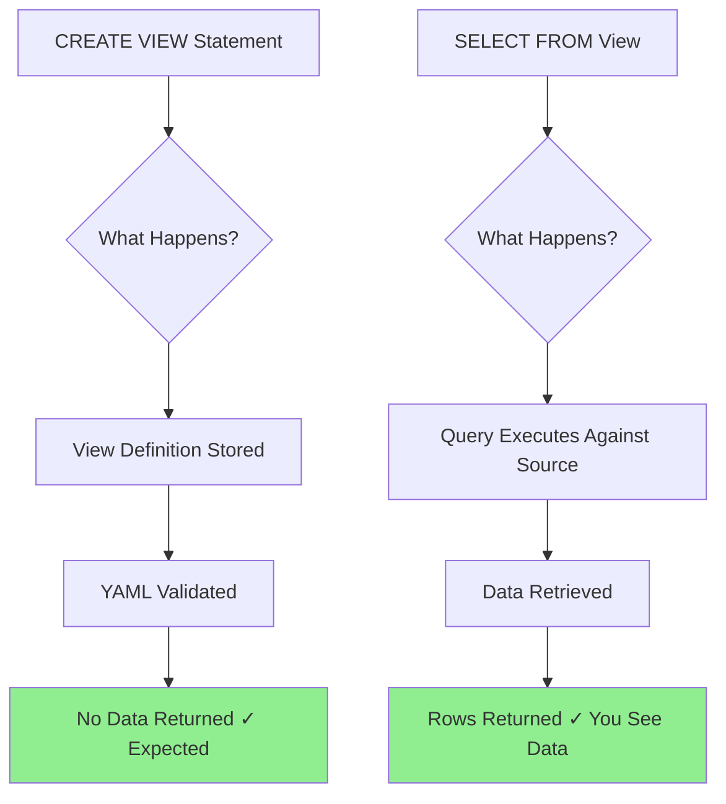

# Understanding Views and Queries - Complete Guide

## Why "No Rows Returned" is Expected and Correct

This guide explains a common point of confusion for stakeholders new to the Semantic Layer POC: **why CREATE VIEW returns no data**.

---

## 🎯 The Core Concept

### **CREATE VIEW vs SELECT FROM VIEW**

| Operation | Purpose | Returns Data? | Analogy |
|-----------|---------|---------------|---------|
| `CREATE VIEW` | **Define** how to query data | ❌ **NO** | Writing a recipe in a cookbook |
| `SELECT FROM view` | **Execute** the query and get results | ✅ **YES** | Following the recipe to make food |

---

## 📖 Real Example from the POC

### **What Happens When Creating a Metric View**

When running this SQL:

```sql
CREATE OR REPLACE VIEW mv_invoice_supplier_semantic_poc
WITH METRICS
LANGUAGE YAML
AS $$
version: 1.1
comment: "Supplier spend metrics"
source: cfascdodev_primary.invoice_semantic_poc.v_invoice_supplier_semantic_poc
dimensions:
  - name: Supplier Name
    expr: supplier_name
measures:
  - name: Total Invoice Amount
    expr: SUM(COALESCE(invoice_amount, 0))
$$;
```

**Result**: `No rows returned` ← **THIS IS CORRECT!**

### **Why No Data?**

The `CREATE VIEW` statement:
1. ✅ **Defines the view structure** (dimensions, measures)
2. ✅ **Stores the definition** in the catalog
3. ✅ **Validates the YAML syntax**
4. ❌ **Does NOT query any data**
5. ❌ **Does NOT return rows**

Think of it as **creating a template** - you're defining HOW to get data, not actually getting it yet.

---

## ✅ How to Actually See Data

### **Step 1: Verify the View Exists**

After running CREATE VIEW, check if it was created:

```sql
-- List all metric views
SHOW VIEWS IN cfascdodev_primary.invoice_semantic_poc LIKE 'mv_%';
```

**Expected Result**:
```
+----------------+-------------------------------+
| namespace      | viewName                      |
+----------------+-------------------------------+
| invoice_sem... | mv_invoice_supplier_seman...  |
| invoice_sem... | mv_invoice_item_semantic_poc  |
| invoice_sem... | mv_invoice_restaurant_sem...  |
| invoice_sem... | mv_invoice_dc_semantic_poc    |
| invoice_sem... | mv_invoice_calendar_seman...  |
+----------------+-------------------------------+
```

---

### **Step 2: Describe the View Structure**

See what dimensions and measures are available:

```sql
-- Describe a metric view
DESCRIBE METRIC VIEW cfascdodev_primary.invoice_semantic_poc.mv_invoice_supplier_semantic_poc;
```

**Expected Result**: Shows columns, data types, and descriptions

---

### **Step 3: Query the View to Get Data**

Now SELECT from the view to see actual data:

```sql
-- Get raw data from metric view
SELECT
  `Invoice Date`,
  `Supplier Name`,
  `Total Invoice Amount`,
  `Total Freight Cost`
FROM cfascdodev_primary.invoice_semantic_poc.mv_invoice_supplier_semantic_poc
LIMIT 10;
```

**Expected Result**:
```
+-------------+--------------+---------------------+-------------------+
| Invoice Date| Supplier Name| Total Invoice Amount| Total Freight Cost|
+-------------+--------------+---------------------+-------------------+
| 2024-01-05  | Fresh Farms  | 1250.00             | 25.00             |
| 2024-01-05  | Ocean Catch  | 2100.00             | 42.00             |
| 2024-01-06  | Spice Route  | 890.00              | 18.00             |
| ...         | ...          | ...                 | ...               |
+-------------+--------------+---------------------+-------------------+
```

✅ **NOW you see data!**

---

## 🔍 Understanding the Difference

### **Visual Flow**



### **Detailed Breakdown**

#### **CREATE VIEW**
```sql
CREATE OR REPLACE VIEW mv_invoice_supplier_semantic_poc
WITH METRICS LANGUAGE YAML AS $$ ... $$;
```

**What Databricks Does:**
1. Parses the YAML definition
2. Validates syntax and field names
3. Checks if source view exists
4. Stores the view metadata in Unity Catalog
5. Returns success (but NO data rows)

**Output**: `Command completed successfully` or `No rows returned`

---

#### **SELECT FROM VIEW**
```sql
SELECT * FROM mv_invoice_supplier_semantic_poc LIMIT 10;
```

**What Databricks Does:**
1. Retrieves the view definition from catalog
2. Expands the view into its underlying SQL
3. Queries the source view (`v_invoice_supplier_semantic_poc`)
4. Source view queries the gold table (`fact_invoice_line_semantic_poc`)
5. Returns actual data rows

**Output**: Data rows (10 in this case)

---

## 📊 Complete Verification Workflow

After deploying the POC, follow this workflow to verify everything works:

### **Phase 1: Verify Object Creation**

```sql
-- ========================================
-- PHASE 1: Verify POC Objects Exist
-- ========================================

-- 1. Check schemas
SHOW SCHEMAS IN cfascdodev_primary LIKE '*semantic_poc*';
-- Expected: 2 schemas (invoice_gold_semantic_poc, invoice_semantic_poc)

-- 2. Check gold tables
SHOW TABLES IN cfascdodev_primary.invoice_gold_semantic_poc;
-- Expected: 6 tables (fact + 5 dimensions)

-- 3. Check semantic views
SHOW VIEWS IN cfascdodev_primary.invoice_semantic_poc
WHERE viewName LIKE 'v_%';
-- Expected: 6 semantic views

-- 4. Check metric views
SHOW VIEWS IN cfascdodev_primary.invoice_semantic_poc
WHERE viewName LIKE 'mv_%';
-- Expected: 5 metric views

-- 5. Check registry tables
SHOW TABLES IN cfascdodev_primary.invoice_semantic_poc;
-- Expected: 3 tables (relationships, metrics, synonyms)
```

**If any of these return 0 results, go back and run the deployment scripts.**

---

### **Phase 2: Verify Data Exists**

```sql
-- ========================================
-- PHASE 2: Verify Data in Tables
-- ========================================

-- 1. Check fact table has data
SELECT COUNT(*) as fact_row_count
FROM cfascdodev_primary.invoice_gold_semantic_poc.fact_invoice_line_semantic_poc;
-- Expected: ~12 rows

-- 2. Check dimensions have data
SELECT
  'dim_supplier' as table_name, COUNT(*) as row_count
FROM cfascdodev_primary.invoice_gold_semantic_poc.dim_supplier_semantic_poc
UNION ALL
SELECT 'dim_item', COUNT(*)
FROM cfascdodev_primary.invoice_gold_semantic_poc.dim_item_semantic_poc
UNION ALL
SELECT 'dim_restaurant', COUNT(*)
FROM cfascdodev_primary.invoice_gold_semantic_poc.dim_restaurant_semantic_poc;
-- Expected: Each dimension has 3-4 rows

-- 3. Sample data from fact table
SELECT *
FROM cfascdodev_primary.invoice_gold_semantic_poc.fact_invoice_line_semantic_poc
LIMIT 5;
-- Expected: Invoice line data with supplier, item, restaurant, DC, date
```

**If row counts are 0, run script 03_seed_data_semantic_poc.sql**

---

### **Phase 3: Verify Semantic Views Work**

```sql
-- ========================================
-- PHASE 3: Query Semantic Views
-- ========================================

-- 1. Query base semantic view
SELECT *
FROM cfascdodev_primary.invoice_semantic_poc.v_invoice_lines_semantic_poc
LIMIT 5;
-- Expected: Invoice lines with calculated measures

-- 2. Query supplier semantic view
SELECT
  supplier_name,
  COUNT(*) as line_count,
  SUM(invoice_amount) as total_spend
FROM cfascdodev_primary.invoice_semantic_poc.v_invoice_supplier_semantic_poc
GROUP BY supplier_name
ORDER BY total_spend DESC;
-- Expected: 3 suppliers (Fresh Farms, Ocean Catch, Spice Route)

-- 3. Query item semantic view
SELECT
  item_name,
  item_category,
  SUM(line_quantity) as total_quantity,
  SUM(invoice_amount) as total_spend
FROM cfascdodev_primary.invoice_semantic_poc.v_invoice_item_semantic_poc
GROUP BY item_name, item_category;
-- Expected: 3 items (lettuce, salmon, cumin)

-- 4. Query restaurant semantic view
SELECT
  restaurant_name,
  restaurant_region,
  SUM(invoice_amount) as total_spend
FROM cfascdodev_primary.invoice_semantic_poc.v_invoice_restaurant_semantic_poc
GROUP BY restaurant_name, restaurant_region;
-- Expected: 3 restaurants (Atlanta, Dallas, Los Angeles)
```

**If these return 0 rows, check that:**
- Gold tables have data
- Views were created after tables
- Joins are working (no FK mismatches)

---

### **Phase 4: Verify Metric Views Work**

```sql
-- ========================================
-- PHASE 4: Query Metric Views
-- ========================================

-- 1. List all metric views
SHOW VIEWS IN cfascdodev_primary.invoice_semantic_poc LIKE 'mv_%';

-- 2. Describe metric view structure
DESCRIBE METRIC VIEW cfascdodev_primary.invoice_semantic_poc.mv_invoice_supplier_semantic_poc;

-- 3. Query metric view (NOTE: Use backticks for friendly names!)
SELECT
  `Invoice Date`,
  `Supplier Name`,
  `Total Invoice Amount`,
  `Total Freight Cost`,
  `Invoice Line Count`
FROM cfascdodev_primary.invoice_semantic_poc.mv_invoice_supplier_semantic_poc
LIMIT 10;
-- Expected: Data with friendly column names

-- 4. Aggregate metric view
SELECT
  `Supplier Name`,
  COUNT(*) as total_lines,
  SUM(`Total Invoice Amount`) as total_spend,
  SUM(`Total Freight Cost`) as total_freight,
  SUM(`Total Tax Cost`) as total_tax
FROM cfascdodev_primary.invoice_semantic_poc.mv_invoice_supplier_semantic_poc
GROUP BY `Supplier Name`
ORDER BY total_spend DESC;
-- Expected: 3 suppliers with aggregated metrics

-- 5. Time-series query
SELECT
  `Invoice Date`,
  COUNT(DISTINCT `Supplier Name`) as supplier_count,
  SUM(`Total Invoice Amount`) as daily_spend,
  AVG(`Total Invoice Amount`) as avg_line_amount
FROM cfascdodev_primary.invoice_semantic_poc.mv_invoice_supplier_semantic_poc
GROUP BY `Invoice Date`
ORDER BY `Invoice Date`;
-- Expected: 4 dates (2024-01-05 to 2024-01-08)
```

**Important**: Metric views use **friendly names with spaces** - always use backticks!

---

## 🎓 Key Concepts to Remember

### **1. Views are Definitions, Not Data**

✅ **Correct Understanding**:
- `CREATE VIEW` = Save a query definition
- `SELECT FROM view` = Execute that query

❌ **Incorrect Understanding**:
- `CREATE VIEW` should return data
- Views store data separately

**Analogy**: Views are like bookmarked queries - the bookmark doesn't contain the page content, it just points to where to find it.

---

### **2. Friendly Names in Metric Views**

**In YAML Definition**:
```yaml
dimensions:
  - name: Supplier Name  # ← This is what you query with
    expr: supplier_name  # ← This is the underlying column
```

**When Querying**:
```sql
-- ✅ CORRECT (use friendly name with backticks)
SELECT `Supplier Name` FROM mv_invoice_supplier_semantic_poc;

-- ❌ WRONG (source column name doesn't exist in metric view)
SELECT supplier_name FROM mv_invoice_supplier_semantic_poc;
```

**Rule**: Always use the **friendly name** defined in YAML `name:` field, wrapped in backticks.

---

### **3. Semantic Views vs Metric Views**

| Aspect | Semantic Views (SQL) | Metric Views (YAML) |
|--------|---------------------|---------------------|
| **Query With** | Standard column names | Friendly names (with backticks) |
| **Example** | `SELECT supplier_name FROM v_invoice_supplier_semantic_poc` | `SELECT `Supplier Name` FROM mv_invoice_supplier_semantic_poc` |
| **Use Case** | Ad-hoc SQL analysis | Business dashboards, Metrics UI |
| **Aggregation** | Defined in SELECT | Pre-defined in YAML measures |

**Both are valid!** Choose based on use case.

---

## 🚨 Common Mistakes and How to Avoid Them

### **Mistake 1: Expecting Data from CREATE VIEW**

❌ **Incorrect Expectation**:
> "I ran CREATE VIEW but didn't see any data. The POC is broken!"

✅ **Correct Understanding**:
> "CREATE VIEW succeeded (view was created). Now I need to SELECT FROM it to see data."

**Solution**: Always follow CREATE VIEW with SELECT:
```sql
-- Step 1: Create view (no data expected)
CREATE OR REPLACE VIEW my_view AS SELECT * FROM my_table;

-- Step 2: Query view (now you get data)
SELECT * FROM my_view LIMIT 10;
```

---

### **Mistake 2: Forgetting Backticks for Friendly Names**

❌ **Incorrect Query**:
```sql
SELECT Supplier Name, Total Invoice Amount  -- Error: syntax error
FROM mv_invoice_supplier_semantic_poc;
```

✅ **Correct Query**:
```sql
SELECT `Supplier Name`, `Total Invoice Amount`  -- ✓ Works!
FROM mv_invoice_supplier_semantic_poc;
```

**Why**: Spaces in column names require backticks in SQL.

---

### **Mistake 3: Confusing View Types**

❌ **Incorrect**:
```sql
-- Trying to use friendly names on semantic view (won't work)
SELECT `Supplier Name` FROM v_invoice_supplier_semantic_poc;
```

✅ **Correct**:
```sql
-- Semantic views use standard SQL column names
SELECT supplier_name FROM v_invoice_supplier_semantic_poc;

-- Metric views use friendly names
SELECT `Supplier Name` FROM mv_invoice_supplier_semantic_poc;
```

---

### **Mistake 4: Not Checking if View Exists**

❌ **Incorrect Approach**:
```sql
SELECT * FROM mv_invoice_supplier_semantic_poc;
-- Error: table or view not found
```

✅ **Correct Approach**:
```sql
-- First, verify view exists
SHOW VIEWS IN cfascdodev_primary.invoice_semantic_poc LIKE 'mv_invoice_supplier%';

-- If it doesn't exist, create it first
-- Then query it
SELECT * FROM mv_invoice_supplier_semantic_poc LIMIT 10;
```

---

## 📋 Verification Checklist

Use this checklist after deployment to ensure everything works:

- [ ] **Schemas exist**: `SHOW SCHEMAS` returns 2 schemas
- [ ] **Gold tables exist**: `SHOW TABLES` returns 6 tables in gold schema
- [ ] **Semantic views exist**: `SHOW VIEWS` returns 6 views starting with `v_`
- [ ] **Metric views exist**: `SHOW VIEWS` returns 5 views starting with `mv_`
- [ ] **Registry tables exist**: 3 tables in semantic schema (relationships, metrics, synonyms)
- [ ] **Fact table has data**: `COUNT(*)` from fact table > 0
- [ ] **Dimensions have data**: Each dimension has 3-4 rows
- [ ] **Semantic views return data**: `SELECT * FROM v_invoice_supplier_semantic_poc LIMIT 5` returns rows
- [ ] **Metric views return data**: ``SELECT `Supplier Name` FROM mv_invoice_supplier_semantic_poc LIMIT 5`` returns rows
- [ ] **Aggregations work**: Group by queries return expected results
- [ ] **Time-series works**: Can filter and group by Invoice Date

**If all checked ✓, the POC is working correctly!**

---

## 💡 Pro Tips for Stakeholders

### **Tip 1: Use SQL Editor Query History**
Databricks SQL Editor saves all your queries. Use it to see what worked before.

### **Tip 2: Start Simple, Then Aggregate**
```sql
-- First, see raw data
SELECT * FROM mv_invoice_supplier_semantic_poc LIMIT 10;

-- Then, aggregate
SELECT `Supplier Name`, SUM(`Total Invoice Amount`)
FROM mv_invoice_supplier_semantic_poc
GROUP BY `Supplier Name`;
```

### **Tip 3: Use Databricks Metrics UI**
For metric views, you can use the no-code Metrics UI instead of SQL:
1. Navigate to **Catalog** → `cfascdodev_primary` → `invoice_semantic_poc`
2. Click on metric view (e.g., `mv_invoice_supplier_semantic_poc`)
3. Drag and drop dimensions and measures to create charts

### **Tip 4: Copy Examples from Documentation**
All the example queries in this guide are copy-paste ready. Use them!

---

## 🎯 Summary

### **Remember These Key Points:**

1. ✅ **CREATE VIEW** = Definition only, no data returned (expected!)
2. ✅ **SELECT FROM view** = Executes query, returns data
3. ✅ **Metric views** = Use backticks for friendly names
4. ✅ **Semantic views** = Use standard SQL column names
5. ✅ **Always verify** = Check views exist before querying

### **Quick Reference Commands:**

```sql
-- Verify views exist
SHOW VIEWS IN cfascdodev_primary.invoice_semantic_poc;

-- Query semantic view
SELECT * FROM cfascdodev_primary.invoice_semantic_poc.v_invoice_supplier_semantic_poc LIMIT 10;

-- Query metric view (note the backticks!)
SELECT `Supplier Name`, `Total Invoice Amount`
FROM cfascdodev_primary.invoice_semantic_poc.mv_invoice_supplier_semantic_poc
LIMIT 10;
```

---

## 📖 Related Documentation

- **Quick Start**: [01_QUICK_START_GUIDE.md](01_QUICK_START_GUIDE.md)
- **Metric Views Explained**: [12_METRIC_VIEWS_EXPLAINED.md](12_METRIC_VIEWS_EXPLAINED.md)
- **Troubleshooting**: [14_METRIC_VIEWS_TROUBLESHOOTING.md](14_METRIC_VIEWS_TROUBLESHOOTING.md)
- **SQL Runbook**: [08_SQL_RUNBOOK.md](08_SQL_RUNBOOK.md)

---

**Document Version**: 1.0
**Last Updated**: 2025-01-20
**Audience**: Business Stakeholders, Analysts, Data Engineers
