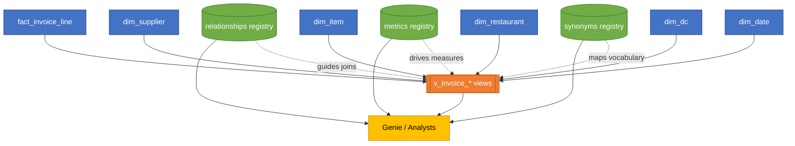

# Semantic Layer Component Deep Dive

## 1. Big Picture
The semantic schema acts as the contract between curated Delta tables and Genie. The relationship, metrics, and synonyms registries give Genie the context it needs to translate natural language into SQL. The `v_invoice_*` views present a business-friendly projection of the star schema so analysts and Genie operate on clean, consistent data.

## 2. Visual Overview

## 3. Relationship Registry
| Aspect | Detail |
|--------|--------|
| Purpose | Explicitly documents how `fact_invoice_line` joins to each dimension. Genie uses it to auto-generate joins when answering questions. |
| Table | `${SCHEMA_SEM}.relationships` |
| Key Columns | `from_table`, `from_column`, `to_table`, `to_column`, `relationship_type`, `join_type`, `confidence`, `notes`. |
| Example Row | `fact_invoice_line`, `supplier_id`, `dim_supplier`, `supplier_id`, `many_to_one`, `inner`, `0.95`, `Supplier key sourced from procurement master`. |
| Why Needed | Genie does not infer foreign keys automatically. Without this registry, it may create cartesian products or fail to join correctly. The registry also helps developers prove join coverage during validation. |
| Failure Modes | Missing row -> Genie cannot traverse to that dimension; incorrect join_type -> analysts see duplicates or missing records; low confidence -> alerts team to review data quality. |
| Implementation Steps | 1) Review data model and confirm keys. 2) Populate the registry with one row per fact-to-dimension relationship. 3) Provide notes for edge cases (e.g., optional relationships). 4) Validate using join reachability query in `/sql/09_validation.sql`. |
| Maintenance | Update when new dimensions are added, keys change, or join logic is refined. Re-run validations after each update. |

## 4. Metrics Registry
| Aspect | Detail |
|--------|--------|
| Purpose | Central catalogue of KPIs and their SQL expressions. Genie references it to understand how to compute measures when users ask for "spend" or "freight cost". |
| Table | `${SCHEMA_SEM}.metrics` |
| Key Columns | `metric_name`, `sql_expression`, `default_agg`, `time_grain`, `valid_dims`, `description`, `owner`, `tags`. |
| Example Row | `invoice_amount`, `coalesce(line_amount,0) + coalesce(freight_amount,0) + coalesce(tax_amount,0)`, `sum`, `invoice_date`, `['dim_supplier','dim_item',...]`, `Total invoiced spend`, `finops@databricks.com`, `['finance','spend']`. |
| Why Needed | Ensures consistent calculations across Genie, dashboards, and SQL notebooks. Provides ownership and discoverability metadata. |
| Failure Modes | No metric registry -> Genie falls back to raw column sums, ignoring business logic; missing owner -> unclear who to contact; invalid expression -> validations fail. |
| Implementation Steps | 1) Gather KPI definitions from finance and sourcing. 2) Translate to SQL expressions at fact grain. 3) Specify allowed dimensions to guard against invalid slicing. 4) Populate registry and test using sample queries. 5) Maintain descriptions for documentation. |
| Maintenance | Review metrics quarterly or when business rules change. Update tags/owners when stewardship shifts. |

## 5. Synonyms Registry
| Aspect | Detail |
|--------|--------|
| Purpose | Bridges business vocabulary to canonical table/column/metric names so Genie can interpret natural language prompts. |
| Table | `${SCHEMA_SEM}.synonyms` |
| Key Columns | `term`, `object_type` (`column`, `table`, `metric`), `canonical_name`, `scope_table`, `notes`. |
| Example Row | `store`, `column`, `dim_restaurant.restaurant_name`, `dim_restaurant`, `Operations shorthand for restaurant name.` |
| Why Needed | Users ask questions using business slang. Without synonyms, Genie may mis-map terms or fail to understand the query. |
| Failure Modes | Missing synonyms -> Genie returns "I do not understand" or uses the wrong field; conflicting synonyms -> ambiguous matches require disambiguation. |
| Implementation Steps | 1) Interview analysts to gather vocabulary. 2) Map each term to canonical names, adding scope to avoid collisions. 3) Populate registry. 4) Test in Genie using benchmark questions. |
| Maintenance | Update synonyms as business terminology evolves. Remove unused terms to reduce ambiguity. |

## 6. Semantic Views (`v_invoice_*`)
| Aspect | Detail |
|--------|--------|
| Purpose | Provide a curated lens over the fact table joined with each dimension, exposing business-friendly column names and pre-calculated measures. |
| Views | `v_invoice_lines`, `v_invoice_supplier`, `v_invoice_item`, `v_invoice_restaurant`, `v_invoice_dc`, `v_invoice_calendar`. |
| Core Columns | Standard identifiers (`invoice_id`, `invoice_line_id`), keys (supplier_id, item_id, etc.), descriptive attributes from dimensions, computed measures (`invoice_amount`, `freight_cost`, `tax_cost`, `line_quantity`). |
| Why Needed | Encapsulate business logic, hide technical columns, and ensure analysts hit consistent definitions. Genie trusts only semantic views, not raw gold tables. |
| Failure Modes | Without views, analysts must join fact/dim tables manually, risking errors. Genie would need raw-table access and additional context, increasing maintenance and governance risk. |
| Implementation Steps | 1) Start with fact table and join necessary dimension table. 2) Select useful columns with business-friendly aliases. 3) Compute derived measures using metrics registry expressions. 4) Document every column with comments. 5) Validate using `/sql/09_validation.sql` and benchmark queries. |
| Maintenance | Update when new attributes or measures are required. Keep column comments synchronized with documentation standards. |

### Can We Skip the Views?
- **Technically possible**: Genie could point directly to gold tables if granted access, but it would require extensive configuration and increase risk.
- **Trade-offs**:
  - **Governance**: Views shield analysts from raw data and enforce access boundaries. Skipping them would mean granting analysts and Genie access to gold tables, violating the "semantic-only" principle.
  - **Consistency**: Views encode naming conventions and derived metrics. Without them, every consumer must remember to apply the same calculations, leading to discrepancies.
  - **Documentation**: Column comments and curated schemas help validation scripts achieve >95 percent coverage. Raw tables often hold ETL metadata columns that confuse users.
- **Recommendation**: Keep the semantic views. They are lightweight, idempotent, and essential for Genie adoption and governance.

## 7. Step-by-Step Usage Flow
1. **Load Gold Tables**: Fact and dimensions reside in `${SCHEMA_GOLD}` after ETL or seed scripts run.
2. **Populate Registries**: Insert rows into `relationships`, `metrics`, and `synonyms`. These provide metadata context.
3. **Create Semantic Views**: Use `/sql/07_semantic_views.sql` to expose curated views referencing gold tables and registry logic.
4. **Run Validation**: Execute `/sql/09_validation.sql` to confirm comment coverage, join reachability, and metric reconciliation.
5. **Configure Genie**: Trust only the semantic views and link the registries so Genie can answer natural-language questions reliably.
6. **Analyst Consumption**: Analysts query the views directly or via Genie, confident that joins, metrics, and terminology are standardised.

## 8. Implementation Checklist
- [ ] Confirm gold tables are accurate and commented.
- [ ] Document join paths and load into relationship registry.
- [ ] Collect KPI definitions and populate metrics registry.
- [ ] Capture business vocabulary and store in synonyms registry.
- [ ] Build and comment semantic views; refresh as data model evolves.
- [ ] Run validations and benchmarks; resolve any `FAIL` statuses.
- [ ] Communicate artefact ownership for ongoing maintenance.

By maintaining these semantic components, the team ensures Genie can translate business questions into accurate SQL while keeping governance and documentation intact.

