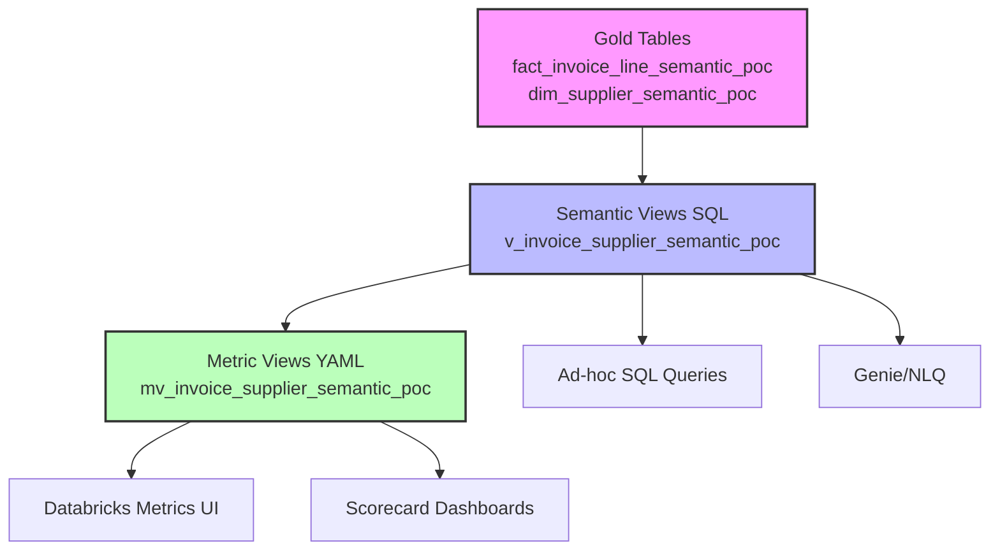

# Metric Views vs Semantic Views - Complete Guide

## Overview

This POC includes both YAML metric views and SQL semantic views:
- **File**: `/sql_semantic_poc/10_metric_views_semantic_poc.sql`
- **Documentation**: `/docs/12_METRIC_VIEWS_YAML_GUIDE.md`

This guide explains the relationship between semantic views (SQL) and metric views (YAML) in the invoice analytics semantic layer.

---

## 1. What Are the Two Types of Views?

### **Semantic Views (SQL)** - File: `07_semantic_views_semantic_poc.sql`

Traditional SQL views that join fact and dimension tables for analytics:

```sql
CREATE OR REPLACE VIEW v_invoice_supplier_semantic_poc AS
SELECT
  l.invoice_id,
  l.invoice_line_id,
  s.supplier_name,
  l.invoice_amount,
  l.freight_cost
FROM v_invoice_lines_semantic_poc l
INNER JOIN dim_supplier_semantic_poc s ON l.supplier_id = s.supplier_id;
```

**Purpose**:
- General-purpose analytics queries
- Ad-hoc SQL analysis
- Data exploration
- Genie/NLQ integration

**Target Users**:
- Analysts writing SQL
- BI tools (Tableau, Power BI)
- Databricks Genie
- Python/R notebooks

---

### **Metric Views (YAML)** - File: `10_metric_views_semantic_poc.sql`

Structured metric definitions built ON TOP of semantic views:

```yaml
CREATE OR REPLACE VIEW mv_invoice_supplier_semantic_poc
WITH METRICS
LANGUAGE YAML
AS $$
version: 1.1
comment: "Supplier spend, freight, tax, discounts, and invoice line counts."
source: cfascdodev_primary.invoice_semantic_poc.v_invoice_supplier_semantic_poc
timestamp: invoice_date
dimensions:
  - name: Supplier Name
    expr: supplier_name
  - name: Supplier Category
    expr: supplier_category
measures:
  - name: Total Invoice Amount
    expr: SUM(COALESCE(invoice_amount, 0))
  - name: Total Freight Cost
    expr: SUM(COALESCE(freight_cost, 0))
  - name: Invoice Line Count
    expr: COUNT(1)
owners:
  - name: Finance Analytics
    email: finance.analytics@example.com
tags:
  - supplier-insights
$$;
```

**Purpose**:
- Pre-defined, governed metrics
- Databricks Metrics UI integration
- Consistent aggregations
- Metadata and governance

**Target Users**:
- Business users via Databricks Metrics UI
- Executives building dashboards
- Governance teams defining KPIs
- Automated scorecards

---

## 2. Relationship Diagram



**Layer 1: Gold Tables** (Raw star schema)
- Fact: `fact_invoice_line_semantic_poc`
- Dimensions: `dim_supplier_semantic_poc`, etc.

**Layer 2: Semantic Views** (SQL - General purpose)
- `v_invoice_supplier_semantic_poc`
- `v_invoice_item_semantic_poc`
- `v_invoice_restaurant_semantic_poc`
- `v_invoice_dc_semantic_poc`
- `v_invoice_calendar_semantic_poc`

**Layer 3: Metric Views** (YAML - Governed metrics)
- `mv_invoice_supplier_semantic_poc`
- `mv_invoice_item_semantic_poc`
- `mv_invoice_restaurant_semantic_poc`
- `mv_invoice_dc_semantic_poc`
- `mv_invoice_calendar_semantic_poc`

---

## 3. POC Semantic Views (SQL) - 6 Views

Located in: `/sql_semantic_poc/07_semantic_views_semantic_poc.sql`

| # | View Name | Purpose | Joins |
|---|-----------|---------|-------|
| 1 | `v_invoice_lines_semantic_poc` | Base view with all measures | Fact only (no joins) |
| 2 | `v_invoice_supplier_semantic_poc` | Supplier analysis | Lines + Supplier dimension |
| 3 | `v_invoice_item_semantic_poc` | Product performance | Lines + Item dimension |
| 4 | `v_invoice_restaurant_semantic_poc` | Restaurant insights | Lines + Restaurant dimension |
| 5 | `v_invoice_dc_semantic_poc` | Distribution center metrics | Lines + DC dimension |
| 6 | `v_invoice_calendar_semantic_poc` | Time series analysis | Lines + Date dimension |

---

## 4. POC Metric Views (YAML) - 5 Views

Located in: `/sql_semantic_poc/10_metric_views_semantic_poc.sql`

| # | Metric View Name | Built On (Source) | Dimensions | Measures |
|---|------------------|-------------------|------------|----------|
| 1 | `mv_invoice_supplier_semantic_poc` | `v_invoice_supplier_semantic_poc` | Supplier ID, Name, Category, Country, Active Flag, Currency | 7 measures (spend, quantity, freight, tax, discount, count) |
| 2 | `mv_invoice_item_semantic_poc` | `v_invoice_item_semantic_poc` | Item ID, Name, Category, UOM, Brand, Active Flag, Currency | 7 measures |
| 3 | `mv_invoice_restaurant_semantic_poc` | `v_invoice_restaurant_semantic_poc` | Restaurant ID, Name, Location, Region, Timezone, Active Flag, Currency | 7 measures |
| 4 | `mv_invoice_dc_semantic_poc` | `v_invoice_dc_semantic_poc` | DC ID, Name, Code, Region, Timezone, Active Flag, Currency | 7 measures |
| 5 | `mv_invoice_calendar_semantic_poc` | `v_invoice_calendar_semantic_poc` | Date Key, Year, Quarter, Month, Week, Day, Weekend, Fiscal Year, Fiscal Period, Currency | 7 measures |

### Common Measures Across All Metric Views:

1. **Total Net Spend**: `SUM(net_line_amount)`
2. **Total Invoice Amount**: `SUM(invoice_amount)`
3. **Total Line Quantity**: `SUM(line_quantity)`
4. **Total Freight Cost**: `SUM(freight_cost)`
5. **Total Tax Cost**: `SUM(tax_cost)`
6. **Total Discount Amount**: `SUM(discount_amount)`
7. **Invoice Line Count**: `COUNT(1)`

---

## 5. Key Differences: Semantic Views vs Metric Views

| Feature | Semantic Views (SQL) | Metric Views (YAML) |
|---------|---------------------|---------------------|
| **Language** | SQL (CREATE VIEW) | YAML (WITH METRICS) |
| **Purpose** | General analytics queries | Pre-defined governed metrics |
| **Aggregation** | User defines in query | Pre-defined in YAML |
| **Metadata** | Comments only | Owners, tags, filters, descriptions |
| **UI Integration** | SQL editors, BI tools | Databricks Metrics UI |
| **Governance** | Ad-hoc | Centrally governed |
| **Use Case** | Flexible exploration | Consistent reporting |
| **Example Query** | `SELECT * FROM v_invoice_supplier_semantic_poc WHERE supplier_name = 'Fresh Farms'` | Select metrics in UI: "Total Invoice Amount by Supplier Name" |

---

## 6. When to Use Each Type?

### Use **Semantic Views** (SQL) When:
- ✅ Writing ad-hoc SQL queries
- ✅ Exploring data interactively
- ✅ Building custom reports
- ✅ Using Genie/NLQ
- ✅ Joining multiple perspectives
- ✅ Needing row-level detail

**Example**:
```sql
-- Analyst writing custom query
SELECT
  supplier_name,
  SUM(invoice_amount) as total_spend,
  AVG(unit_price) as avg_price
FROM v_invoice_supplier_semantic_poc
WHERE invoice_date >= '2024-01-01'
GROUP BY supplier_name;
```

---

### Use **Metric Views** (YAML) When:
- ✅ Building executive dashboards
- ✅ Creating scorecards
- ✅ Enforcing standard KPIs
- ✅ Using Databricks Metrics UI
- ✅ Requiring governance and lineage
- ✅ Wanting point-and-click metrics

**Example**:
In Databricks Metrics UI:
1. Select metric view: `mv_invoice_supplier_semantic_poc`
2. Choose measure: "Total Invoice Amount"
3. Group by: "Supplier Name"
4. Filter: Date range
5. Auto-generates: `SELECT supplier_name, SUM(invoice_amount) FROM ...`

---

## 7. YAML Metric View Structure Explained

```yaml
CREATE OR REPLACE VIEW mv_invoice_supplier_semantic_poc
WITH METRICS              # ← Declares this as a metric view
LANGUAGE YAML            # ← Use YAML syntax (recommended)
AS $$
version: 1.1             # ← Schema version (always 1.1)

comment: "Supplier spend, freight, tax, discounts, and invoice line counts."
                         # ← Description shown in Metrics UI

source: cfascdodev_primary.invoice_semantic_poc.v_invoice_supplier_semantic_poc
                         # ← Which semantic view this is built on

timestamp: invoice_date  # ← Primary time dimension for time-series

dimensions:              # ← Attributes that can be grouped by
  - name: Supplier Name  # ← Friendly name in UI
    expr: supplier_name  # ← SQL expression from source view
  - name: Supplier Category
    expr: supplier_category

measures:                # ← Pre-aggregated metrics
  - name: Total Invoice Amount
    expr: SUM(COALESCE(invoice_amount, 0))  # ← Must include aggregation
  - name: Invoice Line Count
    expr: COUNT(1)

owners:                  # ← Metadata for governance
  - name: Finance Analytics
    email: finance.analytics@example.com

tags:                    # ← For discovery and classification
  - supplier-insights
$$;
```

---

## 8. How to Query Metric Views

### Option 1: Databricks Metrics UI (No-Code)
1. Navigate to **Catalog** → `cfascdodev_primary` → `invoice_semantic_poc`
2. Find metric views (prefixed with `mv_`)
3. Select dimensions and measures
4. Drag and drop to build charts
5. Save as dashboard

### Option 2: SQL Query (Just like regular views)
```sql
-- Metric views can be queried like regular views
SELECT * FROM cfascdodev_primary.invoice_semantic_poc.mv_invoice_supplier_semantic_poc;

-- Custom queries are also supported
SELECT
  `Supplier Name`,
  `Total Invoice Amount`,
  `Total Freight Cost`
FROM cfascdodev_primary.invoice_semantic_poc.mv_invoice_supplier_semantic_poc
WHERE `Supplier Name` = 'Fresh Farms';
```

**Note**: Column names in metric views use the **friendly names** from YAML (e.g., `Supplier Name` not `supplier_name`)

---

## 9. Benefits of YAML Metric Views

| Benefit | Description |
|---------|-------------|
| **Consistency** | All users employ the same metric definitions - eliminates "my revenue vs your revenue" discrepancies |
| **Governance** | Owners, tags, and metadata tracked in code |
| **Discoverability** | Business-friendly names appear in Metrics UI |
| **Pre-aggregation** | Metrics always correctly aggregated (SUM, COUNT, AVG) |
| **Time intelligence** | `timestamp` field enables automatic time-series |
| **Documentation** | Comments and tags explain purpose and usage |
| **Version control** | YAML definitions tracked in Git |
| **Lineage** | Databricks tracks source → metric view → dashboard |

---

## 10. Deployment Order in the POC

The Databricks Asset Bundle deploys in the correct order:

```
Step 1: 01_schemas                    → Create schemas
Step 2: 02_gold_tables                → Create fact and dimensions
Step 3: 03_seed_data                  → Load sample data
Step 4: 04_relationship_registry      → Register joins
Step 5: 05_metrics_registry           → Register metrics
Step 6: 06_synonyms_registry          → Register vocabulary
Step 7: 07_semantic_views             → Create SQL semantic views ← HERE
Step 8: 10_metric_views               → Create YAML metric views ← HERE
Step 9: 08_permissions                → Grant access
Step 10: 09_validation                → Validate everything
```

**Important**: Metric views (step 8) **depend on** semantic views (step 7)

---

## 11. Example Use Cases

### Use Case 1: Executive Dashboard (Use Metric Views)

**Requirement**: "Show total spend by supplier for last quarter"

**Solution**: Use `mv_invoice_supplier_semantic_poc` in Metrics UI
- **Why**: Pre-defined "Total Invoice Amount" measure
- **Benefit**: Consistent across all reports
- **Target User**: Non-technical executive

---

### Use Case 2: Deep Dive Analysis (Use Semantic Views)

**Requirement**: "Find suppliers where freight cost > 10% of spend AND quantity > 100 units"

**Solution**: Write SQL against `v_invoice_supplier_semantic_poc`
```sql
SELECT
  supplier_name,
  SUM(invoice_amount) as total_spend,
  SUM(freight_cost) as total_freight,
  SUM(freight_cost) / SUM(invoice_amount) as freight_pct,
  SUM(line_quantity) as total_qty
FROM v_invoice_supplier_semantic_poc
GROUP BY supplier_name
HAVING freight_pct > 0.10 AND total_qty > 100;
```

**Why**: Complex logic not pre-defined in metric view
**Benefit**: Flexibility for ad-hoc analysis
**Target User**: Data analyst

---

## 12. Viewing Metric Views in Databricks

After deployment, metric views can be found in these locations:

### In Databricks UI:
1. **Catalog Explorer**:
   - Navigate to `cfascdodev_primary` → `invoice_semantic_poc`
   - Look for views with prefix `mv_` (e.g., `mv_invoice_supplier_semantic_poc`)

2. **Metrics UI** (if Metrics Preview enabled):
   - Click **Metrics** in left sidebar
   - Select catalog and schema
   - Browse available metric views

3. **SQL Editor**:
   ```sql
   -- List all metric views
   SHOW VIEWS IN cfascdodev_primary.invoice_semantic_poc LIKE 'mv_%';

   -- Describe a metric view
   DESCRIBE METRIC VIEW cfascdodev_primary.invoice_semantic_poc.mv_invoice_supplier_semantic_poc;
   ```

---

## 13. Quick Reference

### POC Includes Both View Types:

| Type | Count | Location | Purpose |
|------|-------|----------|---------|
| **Semantic Views (SQL)** | 6 views | `07_semantic_views_semantic_poc.sql` | General analytics |
| **Metric Views (YAML)** | 5 views | `10_metric_views_semantic_poc.sql` | Governed metrics |

### Note: Why 6 vs 5?

- **6 Semantic Views**: Includes `v_invoice_lines_semantic_poc` (base view)
- **5 Metric Views**: Excludes base view (built on dimensional views only)

---

## 14. How to Add a New Metric View

**Scenario**: Adding a metric view for average unit price by item

### Step 1: Ensure semantic view exists
```sql
-- Already exists: v_invoice_item_semantic_poc
```

### Step 2: Add to `10_metric_views_semantic_poc.sql`
```yaml
CREATE OR REPLACE VIEW mv_invoice_item_pricing_semantic_poc
WITH METRICS
LANGUAGE YAML
AS $$
version: 1.1
comment: "Item pricing analysis with average unit price metrics."
source: cfascdodev_primary.invoice_semantic_poc.v_invoice_item_semantic_poc
timestamp: invoice_date
dimensions:
  - name: Item Name
    expr: item_name
  - name: Item Category
    expr: item_category
measures:
  - name: Average Unit Price
    expr: AVG(COALESCE(unit_price, 0))
  - name: Min Unit Price
    expr: MIN(unit_price)
  - name: Max Unit Price
    expr: MAX(unit_price)
  - name: Total Quantity
    expr: SUM(COALESCE(line_quantity, 0))
owners:
  - name: Procurement Analytics
    email: procurement@example.com
tags:
  - pricing
  - procurement
$$;
```

### Step 3: Deploy
```bash
# Run script manually or via DAB
databricks bundle run semantic_layer_deploy
```

### Step 4: Grant permissions
Script `08_permissions_semantic_poc.sql` automatically grants access to all views

---

## 15. Documentation References

- **Metric Views Guide**: [12_METRIC_VIEWS_YAML_GUIDE.md](12_METRIC_VIEWS_YAML_GUIDE.md)
- **Databricks Docs**: https://docs.databricks.com/aws/en/metric-views/create/sql
- **SQL Runbook**: [06_SQL_RUNBOOK.md](06_SQL_RUNBOOK.md)
- **Deployment Guide**: [04_DEPLOYMENT_WALKTHROUGH.md](04_DEPLOYMENT_WALKTHROUGH.md)

---

## 16. Summary

### What This POC Includes:

- **Semantic Views (SQL)**: 6 views for flexible analytics
- **Metric Views (YAML)**: 5 metric views for governed reporting
- **Deployment**: Both deployed via scripts 07 and 10 in the DAB pipeline
- **Documentation**: Complete guide available in `12_METRIC_VIEWS_YAML_GUIDE.md`

### Deployment Verification Steps:
1. Run deployment: `databricks bundle run semantic_layer_deploy`
2. Verify metric views exist: `SHOW VIEWS IN invoice_semantic_poc LIKE 'mv_%';`
3. Access Databricks Metrics UI to explore
4. Test queries against both semantic and metric views

### Additional Resources:
- Technical Guide: [12_METRIC_VIEWS_YAML_GUIDE.md](12_METRIC_VIEWS_YAML_GUIDE.md)
- Script Details: [06_SQL_RUNBOOK.md](06_SQL_RUNBOOK.md)

---

**Document Version**: 1.0
**Last Updated**: 2025-01-20
**Maintained by**: Data Engineering Team
