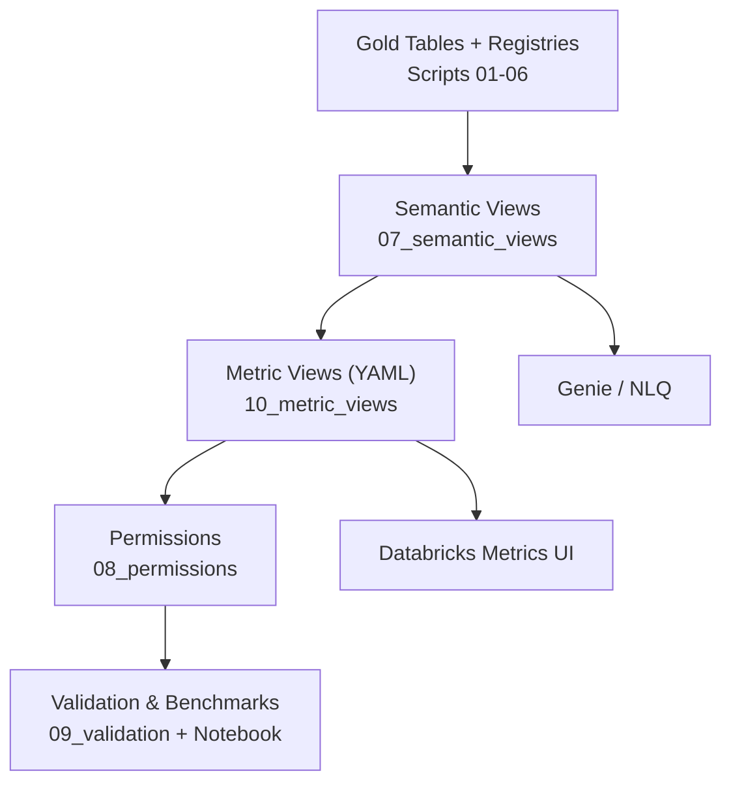

# 12. Metric View Authoring & Migration Guide

This guide explains how to design, implement, and maintain Databricks metric views using the YAML syntax introduced in 2024. It is intended for analytics engineers, data owners, and governance stakeholders who maintain the invoice semantic layer.

## 1. Purpose and Audience
- **Business Outcome**: Deliver a single source of truth for metrics surfaced through Databricks Metrics and Genie.
- **Audience**: Analytics engineers, BI developers, platform engineers, and data stewards responsible for the semantic metric layer.
- **Scope**: Describe YAML-based metric views, compare them with the legacy SQL syntax, show migration steps, and document validation/governance considerations.

## 2. Why YAML Metric Views?

| Capability | SQL Dialect (`CREATE OR REPLACE METRIC VIEW ...`) | YAML Dialect (`CREATE OR REPLACE VIEW ... WITH METRICS LANGUAGE YAML`) |
|------------|----------------------------------------------------|------------------------------------------------------------------------|
| Release stage | Earlier preview | Latest documented syntax (recommended) |
| Metadata support | Comment only | Comments, owners, tags, filters, custom labels |
| Expressiveness | Measures/dimensions/timestamp clauses | Full YAML schema (versioning, filters, formatting) |
| Future roadmap | Maintained for compatibility | Preferred moving forward |

Both syntaxes produce the same Unity Catalog object (`metric_view`). Databricks recommends the YAML form because it captures richer metadata and aligns with future capabilities.

## 3. YAML Metric View Structure

```
CREATE OR REPLACE VIEW catalog.schema.metric_view_name
WITH METRICS
LANGUAGE YAML
AS $$
version: 1.1
comment: "Description shown in Metrics UI"
source: catalog.schema.semantic_view
filter: <optional base filter>
timestamp: <time column or expression>
dimensions:
  - name: Friendly Dimension Name
    expr: <SQL expression>
  - name: ...
measures:
  - name: Friendly Measure Name
    expr: <aggregation expression>
    default_aggregation: sum
    owners:
      - name: Data Steward
        email: data.steward@example.com
    tags:
      - governance-tag
$$;
```

**Key fields**
- `version`: Schema version (use `1.1`).
- `comment`: Visible in Metrics UI and `DESCRIBE METRIC VIEW`.
- `source`: Underlying view/table in the semantic schema.
- `filter`: Optional default filter applied to all queries.
- `timestamp`: Primary time field used by Metrics UI.
- `dimensions` / `measures`: Friendly names and expressions. Aggregations are declared inside `measures`.
- `owners` / `tags`: Optional metadata for governance.

## 4. Migration Checklist (SQL ? YAML)
1. Inventory metric views with `SHOW CREATE TABLE catalog.schema.metric_view`.
2. Map SQL clauses to YAML entries (see table above).
3. Add metadata (owners, tags, filters) as needed.
4. Re-create the object with `CREATE OR REPLACE VIEW ... WITH METRICS LANGUAGE YAML`.
5. Re-run `sql_semantic_poc/08_permissions_semantic_poc.sql` if access needs to include new objects.
6. Execute `sql_semantic_poc/09_validation_semantic_poc.sql` and `notebooks/Benchmark_Questions.sql`.
7. Update documentation (runbook, deployment guides) to note YAML usage.

## 5. Workflow Overview
1. **Build semantic views** (`07_semantic_views_semantic_poc.sql`) so every perspective has a curated source.
2. **Author YAML metric views** inside `sql_semantic_poc/10_metric_views_semantic_poc.sql`.
3. **Deploy** using the Databricks Asset Bundle (`sql_10_metric_views` task) or manual execution.
4. **Apply permissions** (`08_permissions_semantic_poc.sql`) to expose metric views and shield gold tables.
5. **Validate** (`09_validation_semantic_poc.sql`) and **benchmark** (`notebooks/Benchmark_Questions.sql`) for accuracy.
6. **Consume** via Databricks Metrics UI, SQL clients, or Genie.



## 6. YAML Templates for the PoC

Replace the contents of `sql_semantic_poc/10_metric_views_semantic_poc.sql` with the YAML definitions below. They mirror the earlier SQL metric views but include structured metadata.

### 6.1 Supplier Metrics
```
CREATE OR REPLACE VIEW `cfascdodev_primary`.`invoice_semantic_poc`.mv_invoice_supplier_semantic_poc
WITH METRICS
LANGUAGE YAML
AS $$
version: 1.1
comment: "Supplier spend, freight, tax, discounts, and invoice line counts."
source: cfascdodev_primary.invoice_semantic_poc.v_invoice_supplier_semantic_poc
timestamp: invoice_date
dimensions:
  - name: Supplier ID
    expr: supplier_id
  - name: Supplier Name
    expr: supplier_name
  - name: Supplier Category
    expr: supplier_category
  - name: Supplier Country
    expr: supplier_country
  - name: Supplier Active Flag
    expr: supplier_active_flag
  - name: Currency Code
    expr: currency_code
measures:
  - name: Total Net Spend
    expr: SUM(COALESCE(net_line_amount, 0))
  - name: Total Invoice Amount
    expr: SUM(COALESCE(invoice_amount, 0))
  - name: Total Line Quantity
    expr: SUM(COALESCE(line_quantity, 0))
  - name: Total Freight Cost
    expr: SUM(COALESCE(freight_cost, 0))
  - name: Total Tax Cost
    expr: SUM(COALESCE(tax_cost, 0))
  - name: Total Discount Amount
    expr: SUM(COALESCE(discount_amount, 0))
  - name: Invoice Line Count
    expr: COUNT(1)
owners:
  - name: Finance Analytics
    email: finance.analytics@example.com
tags:
  - supplier-insights
$$;
```

### 6.2 Item Metrics
```
CREATE OR REPLACE VIEW `cfascdodev_primary`.`invoice_semantic_poc`.mv_invoice_item_semantic_poc
WITH METRICS
LANGUAGE YAML
AS $$
version: 1.1
comment: "Item-level performance metrics for spend, quantity, freight, and tax."
source: cfascdodev_primary.invoice_semantic_poc.v_invoice_item_semantic_poc
timestamp: invoice_date
dimensions:
  - name: Item ID
    expr: item_id
  - name: Item Name
    expr: item_name
  - name: Item Category
    expr: item_category
  - name: Unit of Measure
    expr: uom
  - name: Brand
    expr: brand
  - name: Item Active Flag
    expr: item_active_flag
  - name: Currency Code
    expr: currency_code
measures:
  - name: Total Net Spend
    expr: SUM(COALESCE(net_line_amount, 0))
  - name: Total Invoice Amount
    expr: SUM(COALESCE(invoice_amount, 0))
  - name: Total Line Quantity
    expr: SUM(COALESCE(line_quantity, 0))
  - name: Total Discount Amount
    expr: SUM(COALESCE(discount_amount, 0))
  - name: Total Freight Cost
    expr: SUM(COALESCE(freight_cost, 0))
  - name: Total Tax Cost
    expr: SUM(COALESCE(tax_cost, 0))
  - name: Invoice Line Count
    expr: COUNT(1)
$$;
```

### 6.3 Restaurant Metrics
```
CREATE OR REPLACE VIEW `cfascdodev_primary`.`invoice_semantic_poc`.mv_invoice_restaurant_semantic_poc
WITH METRICS
LANGUAGE YAML
AS $$
version: 1.1
comment: "Restaurant spend and logistics performance by region, timezone, and location."
source: cfascdodev_primary.invoice_semantic_poc.v_invoice_restaurant_semantic_poc
timestamp: invoice_date
dimensions:
  - name: Restaurant ID
    expr: restaurant_id
  - name: Restaurant Name
    expr: restaurant_name
  - name: Location Number
    expr: location_number
  - name: Restaurant Region
    expr: restaurant_region
  - name: Restaurant Timezone
    expr: restaurant_timezone
  - name: Restaurant Active Flag
    expr: restaurant_active_flag
  - name: Currency Code
    expr: currency_code
measures:
  - name: Total Net Spend
    expr: SUM(COALESCE(net_line_amount, 0))
  - name: Total Invoice Amount
    expr: SUM(COALESCE(invoice_amount, 0))
  - name: Total Line Quantity
    expr: SUM(COALESCE(line_quantity, 0))
  - name: Total Freight Cost
    expr: SUM(COALESCE(freight_cost, 0))
  - name: Total Tax Cost
    expr: SUM(COALESCE(tax_cost, 0))
  - name: Total Discount Amount
    expr: SUM(COALESCE(discount_amount, 0))
  - name: Invoice Line Count
    expr: COUNT(1)
$$;
```

### 6.4 Distribution Center Metrics
```
CREATE OR REPLACE VIEW `cfascdodev_primary`.`invoice_semantic_poc`.mv_invoice_dc_semantic_poc
WITH METRICS
LANGUAGE YAML
AS $$
version: 1.1
comment: "Distribution center spend and logistics metrics."
source: cfascdodev_primary.invoice_semantic_poc.v_invoice_dc_semantic_poc
timestamp: invoice_date
dimensions:
  - name: Distribution Center ID
    expr: dc_id
  - name: Distribution Center Name
    expr: dc_name
  - name: Distribution Center Code
    expr: dc_code
  - name: Distribution Center Region
    expr: dc_region
  - name: Distribution Center Timezone
    expr: dc_timezone
  - name: Distribution Center Active Flag
    expr: dc_active_flag
  - name: Currency Code
    expr: currency_code
measures:
  - name: Total Net Spend
    expr: SUM(COALESCE(net_line_amount, 0))
  - name: Total Invoice Amount
    expr: SUM(COALESCE(invoice_amount, 0))
  - name: Total Line Quantity
    expr: SUM(COALESCE(line_quantity, 0))
  - name: Total Freight Cost
    expr: SUM(COALESCE(freight_cost, 0))
  - name: Total Tax Cost
    expr: SUM(COALESCE(tax_cost, 0))
  - name: Total Discount Amount
    expr: SUM(COALESCE(discount_amount, 0))
  - name: Invoice Line Count
    expr: COUNT(1)
$$;
```

### 6.5 Calendar Metrics
```
CREATE OR REPLACE VIEW `cfascdodev_primary`.`invoice_semantic_poc`.mv_invoice_calendar_semantic_poc
WITH METRICS
LANGUAGE YAML
AS $$
version: 1.1
comment: "Calendar and fiscal trend metrics for invoice spend and quantity."
source: cfascdodev_primary.invoice_semantic_poc.v_invoice_calendar_semantic_poc
timestamp: invoice_date
dimensions:
  - name: Date Key
    expr: date_key
  - name: Calendar Year
    expr: calendar_year
  - name: Calendar Quarter
    expr: calendar_quarter
  - name: Calendar Month
    expr: calendar_month
  - name: Calendar Week
    expr: calendar_week
  - name: Calendar Day
    expr: calendar_day
  - name: Weekend Flag
    expr: is_weekend
  - name: Fiscal Year
    expr: fiscal_year
  - name: Fiscal Period
    expr: fiscal_period
  - name: Currency Code
    expr: currency_code
measures:
  - name: Total Net Spend
    expr: SUM(COALESCE(net_line_amount, 0))
  - name: Total Invoice Amount
    expr: SUM(COALESCE(invoice_amount, 0))
  - name: Total Line Quantity
    expr: SUM(COALESCE(line_quantity, 0))
  - name: Total Freight Cost
    expr: SUM(COALESCE(freight_cost, 0))
  - name: Total Tax Cost
    expr: SUM(COALESCE(tax_cost, 0))
  - name: Total Discount Amount
    expr: SUM(COALESCE(discount_amount, 0))
  - name: Invoice Line Count
    expr: COUNT(1)
$$;
```

## 7. Deployment Workflow
1. Update the SQL script with YAML definitions.
2. Deploy via the Databricks Asset Bundle (`databricks bundle run semantic_layer_deploy`) or run manually.
3. Validate with `09_validation_semantic_poc.sql` and `Benchmark_Questions.sql`.
4. Review the metric views in the Metrics UI under `Catalog ? Schema ? Metric Views`.
5. Commit the SQL and documentation changes to version control.

## 8. Governance & Validation
- **Permissions**: `GRANT SELECT` on the metric view is required for analysts. Existing governance script covers this.
- **Documentation**: Keep metric descriptions in YAML comments in sync with `metrics_semantic_poc`.
- **Validation**: Extend the validation script if new measures or filters are introduced.
- **Change management**: Use pull requests, DAB deployments, and the runbook to coordinate releases.

## 9. Troubleshooting
- **YAML parse error**: Check indentation (two spaces) and quote expressions containing colons.
- **Metric view missing in UI**: Ensure Metrics (Preview) is enabled and you granted access.
- **Unexpected aggregations**: Confirm each measure uses `SUM(...)`, `COUNT(...)`, etc. YAML expressions should contain the aggregation directly.
- **Need multiple time dimensions**: Use `timestamp:` for the default, and add additional time expressions under `dimensions`.

## 10. Next Steps
1. Migrate any remaining SQL-style metric views to YAML using this guide.
2. Add `owners` and `tags` metadata to improve discoverability.
3. Automate metric view creation through CI/CD using templates or parameterised YAML.
4. Socialise this guide with stakeholders so everyone understands how the semantic metric layer is governed.


