# Semantic Layer Deployment Flow – Detailed Guide

## Improved Prompt
Deliver a comprehensive guide for the semantic layer deployment flow that:
1. Explains the purpose of each step (environment validation through operational monitoring) and why it must occur in order.
2. Describes prerequisites, inputs, outputs, and what could fail if a step is skipped.
3. Connects each step to the required artifacts (schemas, registries, views, validations, Genie configuration, CI/CD jobs).
4. Includes a stakeholder-ready visual (Mermaid flowchart) that captures dependencies, decision gates, and feedback loops.
5. Provides talking points for stakeholders: what we need from them, how they can verify completion, and what assurances each step gives.
6. Highlights alternative scenarios (e.g., what happens if we defer benchmarks or skip registries) to explain trade-offs.

## 1. Flow Diagram

```mermaid
graph TD
  classDef prep fill:#4472c4,color:#ffffff,stroke:#27408b
  classDef build fill:#70ad47,color:#ffffff,stroke:#38761d
  classDef validate fill:#ed7d31,color:#ffffff,stroke:#c15100
  classDef launch fill:#ffc000,color:#000000,stroke:#b8860b
  classDef operate fill:#607d8b,color:#ffffff,stroke:#37474f

  Start[[Start Deployment]]:::prep
  Env[Validate environment placeholders
Inputs: catalog, schemas, warehouse, groups
Output: confirmed variables]:::prep
  Schemas[Run 01_schemas.sql
Creates catalog & schemas]:::build
  GoldTables[Run 02_gold_tables.sql
Creates fact/dim tables w/ comments]:::build
  SeedData[Run 03_seed_data.sql
Loads sample dataset]:::build
  Registries[Run 04-06 registries
Relationships, metrics, synonyms]:::build
  Views[Run 07_semantic_views.sql
Publishes v_invoice_* views]:::build
  Permissions[Run 08_permissions.sql
Grants semantic access, revokes gold]:::build
  Validation[Run 09_validation.sql
Checks comments, joins, metrics]:::validate
  GapReport[Run metadata_gap_report.sql
Identifies missing comments/synonyms]:::validate
  Benchmarks[Execute Benchmark_Questions.sql
Confirms Genie answers]:::validate
  Genie[Configure Genie Space
Trust views, load registries & benchmarks]:::launch
  DAB[Deploy databricks.yml
Automated pipeline]:::launch
  Jobs[Schedule jobs.json
Nightly validation & benchmarks]:::operate
  Operate[Operate, monitor, improve
Alert handling, enhancements]:::operate

  Start --> Env --> Schemas --> GoldTables --> SeedData --> Registries --> Views --> Permissions --> Validation --> GapReport --> Benchmarks --> Genie --> DAB --> Jobs --> Operate
```

## 2. Step-by-Step Breakdown

### 2.1 Validate Environment Placeholders (Inputs Confirmation)
- **What**: Confirm `CATALOG`, `SCHEMA_GOLD`, `SCHEMA_SEM`, `GROUP_ANALYSTS`, `WAREHOUSE_NAME` values.
- **Why**: Prevents scripts from creating or modifying objects in the wrong namespace. All downstream scripts reference these variables.
- **Prerequisites**: Unity Catalog privileges, existing warehouse, governance approval for groups.
- **Stakeholder Ask**: Provide environment names, confirm governance approval for catalog creation, ensure analyst group exists.
- **If Skipped**: Deployments may fail or pollute an unintended environment, causing rework.

### 2.2 Run 01_schemas.sql (Catalog & Schema Creation)
- **What**: Creates/ensures the catalog and gold/semantic schemas exist, with comments and ownership.
- **Why**: Establishes the namespace for gold tables and semantic assets; required before any tables or views can be created.
- **Prerequisites**: Environment placeholders validated, platform admin permissions.
- **Outputs**: Catalog `cfa_demo`, schemas `gold`, `semantic_analytics`.
- **Risk if Skipped**: Later scripts error; governance cannot manage assets.

### 2.3 Run 02_gold_tables.sql (Gold Tables Definition)
- **What**: Creates `fact_invoice_line` and dimension tables with column comments and table properties.
- **Why**: Defines the star schema foundation that semantic views rely on.
- **Prerequisites**: Schemas exist, data model approved.
- **Stakeholder Ask**: Confirmation of column definitions, data types, and comment text.
- **Risk if Skipped**: Semantic views, metrics, and validation have no data structure to operate on.

### 2.4 Run 03_seed_data.sql (Seed Dataset)
- **What**: Inserts sample rows into dimensions and fact to support immediate testing.
- **Why**: Allows validations, benchmarks, and Genie checks to run without waiting for production ingestion.
- **Prerequisites**: Gold tables created, seed data defined.
- **Risk if Skipped**: Validations and benchmarks may return zero rows; Genie demos fail.

### 2.5 Run 04_relationship_registry.sql, 05_metrics_registry.sql, 06_synonyms_registry.sql (Semantic Registries)
- **What**: Populate three registries capturing join paths, KPI definitions, and business vocabulary.
- **Why**: Provide metadata context so Genie can answer natural-language questions accurately and so validation queries know expected relationships.
- **Prerequisites**: Gold data model stabilized, business definitions approved.
- **Stakeholder Ask**: Approve join confidence, KPI formulas, synonym glossary.
- **Risk if Skipped**: Genie mis-joins tables, computes wrong metrics, or fails to understand queries.

### 2.6 Run 07_semantic_views.sql (Semantic Views)
- **What**: Create `v_invoice_*` views that join fact to dimensions and expose friendly columns.
- **Why**: Provide the surfaced data set for Genie and analysts; central place for documentation.
- **Prerequisites**: Registries populated, gold tables ready.
- **Stakeholder Ask**: Review view columns, naming conventions, computed measures.
- **Risk if Skipped**: Users must join raw tables manually; access controls cannot differentiate; NLQ accuracy drops.

### 2.7 Run 08_permissions.sql (Governance Controls)
- **What**: Grant analysts usage/select on semantic schema, revoke direct gold access.
- **Why**: Enforces "semantic-only" access, reducing risk of misuse and ensuring consistent metrics.
- **Prerequisites**: Previous steps completed, security approvals.
- **Stakeholder Ask**: Confirm analyst group membership; review governance policy.
- **Risk if Skipped**: Analysts may query raw tables, producing conflicting results or exposing sensitive data.

### 2.8 Run 09_validation.sql (Quality Gate)
- **What**: Checks comment coverage, join reachability, metric reconciliation, sample aggregates.
- **Why**: Ensures documentation and logic meet standards before release.
- **Prerequisites**: Views and registries in place.
- **Stakeholder Ask**: Agree on pass/fail thresholds and review output.
- **Risk if Skipped**: Undetected data model issues reach analysts; trust erodes.

### 2.9 Run metadata_gap_report.sql (Documentation Audit)
- **What**: Lists columns/metrics missing comments or synonyms.
- **Why**: Helps maintain documentation hygiene; supports audits.
- **Prerequisites**: Validation run, registries populated.
- **Stakeholder Ask**: Assign owners to remediate gaps.
- **Risk if Skipped**: Comment coverage may slip below policy; NLQ accuracy declines.

### 2.10 Execute Benchmark_Questions.sql (NLQ Benchmarks)
- **What**: Runs curated queries to confirm Genie can answer key business questions.
- **Why**: Acts as regression suite for natural-language performance.
- **Prerequisites**: Views, metrics, synonyms ready; dataset loaded.
- **Stakeholder Ask**: Approve expected answers; participate in review.
- **Risk if Skipped**: Genie may ship with untested behaviour; analysts lose trust.

### 2.11 Configure Genie Space (AI/BI Setup)
- **What**: Trust semantic views, register metrics/synonyms/relationships, load benchmarks, set access.
- **Why**: Connects the semantic layer to the analyst experience.
- **Prerequisites**: Validations successful; governance approvals.
- **Stakeholder Ask**: Provide workspace access, confirm trusted assets, approve space name/description.
- **Risk if Skipped**: Genie cannot use the semantic layer; project value unrealised.

### 2.12 Deploy databricks.yml (Automation)
- **What**: Use Databricks Asset Bundle to orchestrate SQL and validation steps in order.
- **Why**: Enables repeatable deployments across environments; reduces manual error.
- **Prerequisites**: DAB tooling enabled, repository connected.
- **Stakeholder Ask**: Approve pipeline integration, provide service principals.
- **Risk if Skipped**: Manual runs may diverge; difficult to promote to production.

### 2.13 Schedule jobs.json (Nightly Monitoring)
- **What**: Create Databricks job to rerun validation and benchmark notebook on schedule with alerts.
- **Why**: Maintains trust after go-live; detects regressions quickly.
- **Prerequisites**: DAB deployed or manual job creation allowed.
- **Stakeholder Ask**: Provide alert recipients, SLA expectations.
- **Risk if Skipped**: Issues go unnoticed until end users report them.

### 2.14 Operate, Monitor, Improve (Continuous Improvement)
- **What**: Review validation results, update registries/views, expand metrics, and remediate alerts.
- **Why**: Keeps semantic layer accurate as business requirements evolve.
- **Stakeholder Ask**: Participate in change management, provide feedback, approve new KPIs.
- **Risk if Skipped**: Semantic layer becomes stale; adoption drops.

## 3. Stakeholder Talking Points
For each step, communicate:
- **Need**: e.g., "We need finance to approve the invoice_amount definition before we populate the metrics registry."
- **Verification**: "You will receive the validation report showing comment coverage and metric reconciliation."
- **Risk of Omission**: "If we skip the benchmark notebook, we cannot guarantee Genie will answer cost-savings questions correctly."

## 4. Alternative & Trade-off Scenarios
- **Skipping Registries**: Genie would lack metadata to interpret queries, leading to incorrect joins/metrics. Not recommended.
- **Bypassing Semantic Views**: Analysts would access gold tables directly, increasing governance risk and inconsistent calculations.
- **Delaying Benchmarks**: Genie would launch without NLQ assurance; adoption likely suffers.
- **Ignoring Automation**: Deploying manually increases time-to-release and introduces human error; CI/CD ensures parity.

## 5. Inputs & Outputs Summary
| Step | Key Inputs | Key Outputs |
|------|------------|-------------|
| Validate placeholders | Environment plan, governance approvals | Confirmed variables |
| 01_schemas.sql | Catalog name, permissions | Catalog + schemas |
| 02_gold_tables.sql | Data model spec | Delta tables with comments |
| 03_seed_data.sql | Seed values | Seed dataset |
| Registries | KPI catalogue, join rules, glossary | Relationship/metrics/synonym rows |
| 07_semantic_views.sql | Fact/dim tables, metrics expressions | Semantic views |
| 08_permissions.sql | Group definitions | Grants/revokes |
| 09_validation.sql | Semantic views, registries | Validation report |
| metadata_gap_report.sql | Metadata tables | Gap report |
| Benchmark notebook | Benchmark list | SQL results, expected answers |
| Configure Genie | Registries, views, space access | Published Genie Space |
| databricks.yml | SQL files, workspace host | Automated deployment job |
| jobs.json | Validation scripts, warehouse | Scheduled pipeline |
| Operate | Alerting config, change process | Ongoing improvements |

## 6. Prep Checklist for Kickoff
- [ ] Environment placeholders confirmed & documented.
- [ ] Governance approves catalog/schema creation and analyst group access.
- [ ] KPI catalogue, join rules, synonyms collected and signed off.
- [ ] Warehouse availability and CI/CD tooling verified.
- [ ] Benchmark questions and expected results endorsed by business.
- [ ] Operational ownership (on-call rota, alert channels) established.

This guide equips you to walk stakeholders through the deployment visual, answer "why", "what if we skip", and "what do you need from me" for every step, ensuring a transparent, reliable semantic layer rollout.
