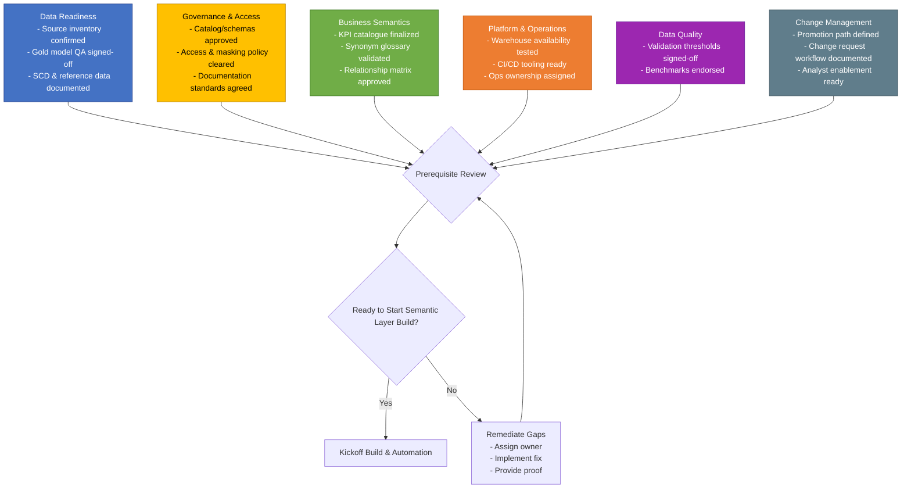

# Semantic Layer Prerequisites Playbook

## 1. Purpose
The semantic layer relies on trusted gold data, documented business definitions, and operating controls. This playbook ensures everyone understands the questions to resolve, why they matter, and how to validate readiness.

## 2. How to Use This Playbook
1. Convene stakeholders from data engineering, analytics engineering, governance, platform operations, and business teams.
2. Walk through each prerequisite section, documenting answers and linking artefacts.
3. Record gaps and assign remediation owners/target dates.
4. Re-run the review once gaps are closed; only then trigger semantic layer engineering.
5. Maintain the artefacts (KPI catalogue, governance approvals, validation specs) alongside the codebase for traceability.

## 3. Detailed Prerequisites

### 3.1 Data Readiness
| # | Question | What “Yes” Looks Like | Why It Matters | Consequence if Ignored | Primary Owner(s) | Example Artefacts |
|---|----------|------------------------|----------------|------------------------|------------------|-------------------|
| D1 | Which upstream systems supply invoices, suppliers, restaurants, distribution centers, and items? | We have an inventory of source systems, owners, refresh cadences, and data contracts. | Defines ingestion scope and helps align transformations with source nuances. | Missing feeds lead to incomplete facts/dims, breaking joins and creating gaps in Genie. | Data Engineer, Source System Owners | Source system registry, lineage diagram, ingestion architecture deck |
| D2 | Are gold fact and dimension tables modeled, populated, and validated? | Star schema tables exist in `${SCHEMA_GOLD}`, with QA sign-off on counts, null checks, and key coverage. | Semantic views assume gold tables are accurate; otherwise the semantic layer amplifies errors. | Analysts see incorrect spend numbers; validations and benchmarks fail. | Data Engineer | Data model ERD, QA results, unit test notebook |
| D3 | How are slowly changing dimensions handled (type, effective dating, default end dates)? | Documented SCD strategy with examples; effective_from/effective_to semantics agreed. | Ensures historical analysis from Genie matches finance reporting and avoids double-counting. | Point-in-time questions return inconsistent answers, damaging trust. | Data Engineer, Analytics Engineer | Dimension design docs, sample queries showing SCD behavior |
| D4 | Are critical reference datasets (currency codes, regions, etc.) standardized? | Reference tables exist and align with corporate standards. | Prevents mismatched labels across joins and ensures filters behave correctly. | Users see duplicate categories or mis-aggregations in Genie outputs. | Data Engineer | Reference data spec, validation queries |

### 3.2 Governance & Access
| # | Question | What “Yes” Looks Like | Why It Matters | Consequence if Ignored | Primary Owner(s) | Example Artefacts |
|---|----------|------------------------|----------------|------------------------|------------------|-------------------|
| G1 | Which catalog and schemas will host gold and semantic assets? | Catalog `cfa_demo` & schemas `gold`, `semantic_analytics` approved with ownership assignments. | Needed for scripts, grants, and automation variables. | Deployments fail or land in uncontrolled namespaces. | Platform Admin | Unity Catalog governance document, RBAC matrix |
| G2 | Who authorizes access for `${GROUP_ANALYSTS}` and other consumers? | Governance lead approves analyst group membership and roles. | Ensures compliance with data policies before enabling Genie. | Unauthorized access or audit findings. | Governance Lead | Access request approvals, security ticket |
| G3 | What documentation/comment coverage standard applies (>=95%)? | The team agrees to maintain comments on tables/columns and knows validation thresholds. | Validation scripts enforce documentation; clarity avoids last-minute failures. | Automated validation fails, delaying releases. | Governance Lead, Data Engineer | Documentation policy, comment templates |
| G4 | Are there data retention or masking requirements for invoice data? | Compliance team confirms masking or retention rules and how they apply to semantic views. | Ensures PII/compliance obligations are met before exposure to analysts. | Potential policy violations or rework to retro-fit masking. | Governance Lead, Legal/Compliance | Data classification report, masking strategy |

### 3.3 Business Semantics & Metrics
| # | Question | What “Yes” Looks Like | Why It Matters | Consequence if Ignored | Primary Owner(s) | Example Artefacts |
|---|----------|------------------------|----------------|------------------------|------------------|-------------------|
| B1 | What KPIs are in scope (invoice_amount, total_spend, avg_price, etc.)? | KPI catalogue lists definitions, formulas, owners, and tags. | Feeds the metrics registry and aligns with finance expectations. | Conflicting numbers between Genie and dashboards; lack of ownership. | Analytics Engineer, Finance | KPI dictionary, finance reporting deck |
| B2 | Are there agreed business rules for discounts, freight, tax allocations? | Documented logic (e.g., positive discount means reduction) reviewed with finance/logistics. | Ensures semantic views calculate measures consistent with business reporting. | Metrics are misinterpreted, leading to escalations from users. | Analytics Engineer, Finance, Logistics | Business rule document, sample calculations |
| B3 | What synonyms/vocabulary do analysts use (store, supplier, DC, spend, etc.)? | Synonym glossary mapping business terms to canonical names validated with end users. | Enables accurate NLQ mapping in Genie and reduces training overhead. | Genie misinterprets prompts, reducing adoption and trust. | Analytics Engineer, Analyst SMEs | Vocabulary workshop notes, glossary spreadsheet |
| B4 | Which fact-to-dimension joins are trusted and under what confidence? | Relationship matrix with join type, confidence scores, and known caveats. | Populates relationship registry and guides Genie join logic. | Genie may use incorrect joins, producing wrong answers. | Analytics Engineer, Data Engineer | Join validation notebook, data quality reports |

### 3.4 Platform & Operational Readiness
| # | Question | What “Yes” Looks Like | Why It Matters | Consequence if Ignored | Primary Owner(s) | Example Artefacts |
|---|----------|------------------------|----------------|------------------------|------------------|-------------------|
| P1 | Is the target SQL warehouse (`serverless_sql_wh`) provisioned with required permissions? | Warehouse exists, is accessible by deployment principals, and sized for validation workloads. | All SQL scripts and Genie rely on this warehouse. | Deployment scripts fail; Genie cannot run queries. | Platform Admin | Warehouse config screenshot, access test results |
| P2 | Are Databricks Asset Bundles and repos enabled? | Workspace allows DAB deployment and repo integration. | CI/CD automation in `databricks.yml` depends on these features. | Manual execution increases risk of errors. | Platform Admin | Workspace capability checklist, test deployment |
| P3 | Who owns ongoing job execution and incident response? | On-call rotation or owner defined; runbooks and alert destinations documented. | Validation job needs active monitoring to maintain trust. | Failures go unnoticed; issues reach analysts before fixes. | Platform Admin, Operations | Runbook, escalation matrix |
| P4 | Are environment promotion paths (dev/test/prod) established? | Strategy defined for how assets move between environments, including data refresh cadence. | Supports safe rollouts and testing before production. | Direct prod changes risk outages and misconfigurations. | Platform Admin, Governance Lead | Environment strategy doc, pipeline diagram |

### 3.5 Data Quality & Validation
| # | Question | What validation thresholds and KPIs define success? | What “Yes” Looks Like | Why It Matters | Consequence if Ignored | Primary Owner(s) | Example Artefacts |
|---|----------|------------------------|----------------|------------------------|------------------|-------------------|
| Q1 | Comment coverage threshold (>=95%) agreed? | Stakeholders approve threshold and remediation plan when below target. | Aligns with `/sql/09_validation.sql` PASS/FAIL logic. | Disagreements on "done" definition cause release delays. | Governance Lead | QA policy, validation checklist |
| Q2 | Metric reconciliation rules accepted? | Finance signs off that total_spend equals net_line + freight + tax, etc. | Validation queries confirm core financial logic before release. | Unvetted logic may pass validation but fail business checks later. | Finance, Analytics Engineer | Reconciliation spec, sample results |
| Q3 | Genie benchmark questions approved? | Benchmark set (15-20 questions) with expected SQL/answers endorsed by business. | Enables `/notebooks/Benchmark_Questions.sql` to certify NLQ readiness. | No baseline for Genie regression testing; adoption suffers. | Analytics Engineer, Business Stakeholders | Benchmark acceptance sheet |

### 3.6 Change Management & Communication
| # | Question | What “Yes” Looks Like | Why It Matters | Consequence if Ignored | Primary Owner(s) | Example Artefacts |
|---|----------|------------------------|----------------|------------------------|------------------|-------------------|
| C1 | What is the change request process for metrics/synonyms/permissions? | Documented workflow (e.g., JIRA, CAB) with SLAs and approvers. | Maintains governance after go-live and ensures registries stay accurate. | Ad-hoc changes break automation, leading to inconsistent results. | Governance Lead | Change management SOP |
| C2 | How will analysts be onboarded to Genie and semantic views? | Training plan or documentation prepared, including runbooks and FAQ. | Drives adoption and reduces support overhead. | Users may misuse assets or revert to manual workarounds. | Analytics Enablement Lead | Training deck, onboarding checklist |
| C3 | Where will artefacts live (KPI catalogue, policies, validation logs)? | Central repository (Confluence, SharePoint, repo docs) with access controls. | Provides traceability and quick reference during audits. | Knowledge becomes siloed or lost; onboarding new members is slow. | Governance Lead, Platform Admin | Documentation site, repo README |

## 4. Visual – Prerequisite Intake Flow (Expanded)

## 5. Intake Workshop Facilitation Tips
- Schedule a 60-90 minute session with cross-functional stakeholders.
- Review prerequisites in advance and ask owners to bring artefacts (documents, screenshots, query results).
- Log decisions and gaps in a shared tracker; include due dates.
- If disagreements arise (e.g., metric definition), note them as blockers and assign follow-up sessions.
- Once all prerequisites show "Yes" with evidence, document the decision and notify leadership that semantic layer engineering can proceed.

## 6. Ongoing Maintenance
- Revisit this checklist whenever new data sources or metrics are added.
- Include prerequisite review in quarterly governance meetings to ensure artefacts remain current.
- Embed the checklist in onboarding for new team members working on semantic layer evolution.

This playbook equips teams with a detailed, self-explanatory prerequisite framework to launch the semantic layer confidently and keep it governed over time.

